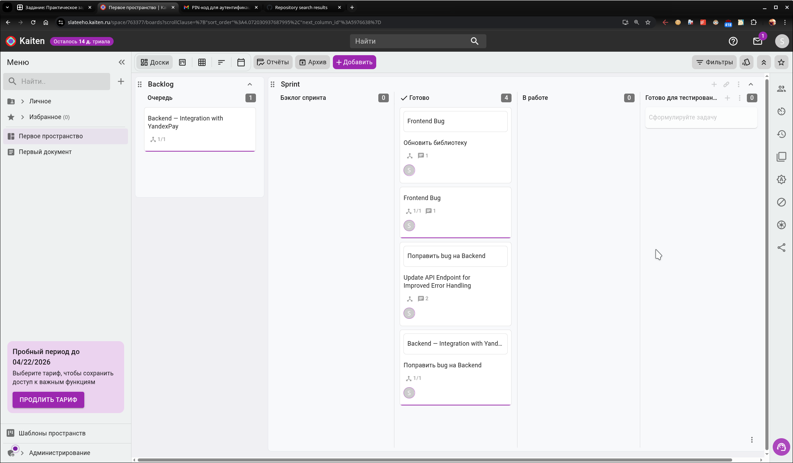

# Непрерывная разработка и интеграция

1. Teamcity 

## Задание 1

[Ссылка на репозиторий Teamcity, содержащий измененный `aragastmatb/example-teamcity` и конфигурации проекта DSL](https://github.com/slateeho/TeamCityPipeline)

2. Жизненный цикл ПО

[Доски `Kaiten`](https://slateeho.kaiten.ru/p/f087c3f6-0d4a-4fe2-a41e-778784331eb5)

Скриншот досок `Kaiten`:

