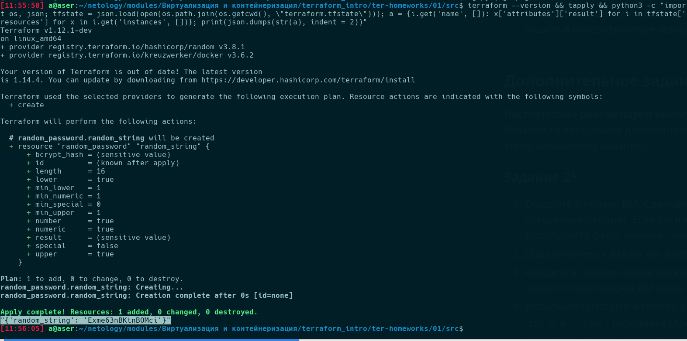
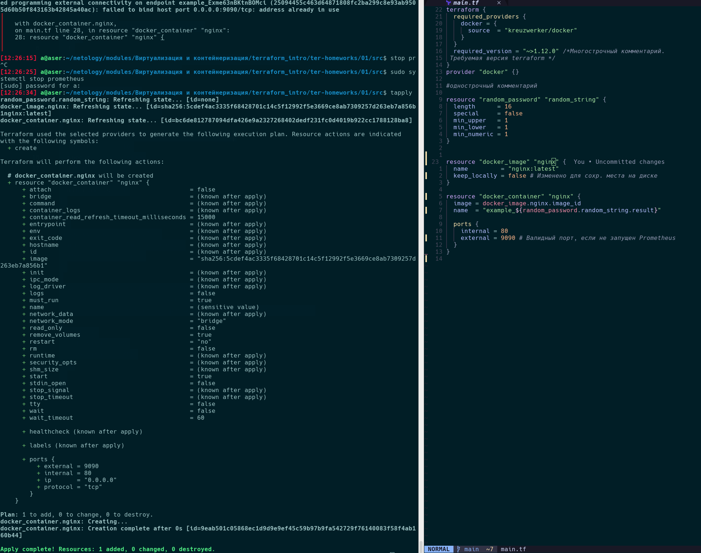
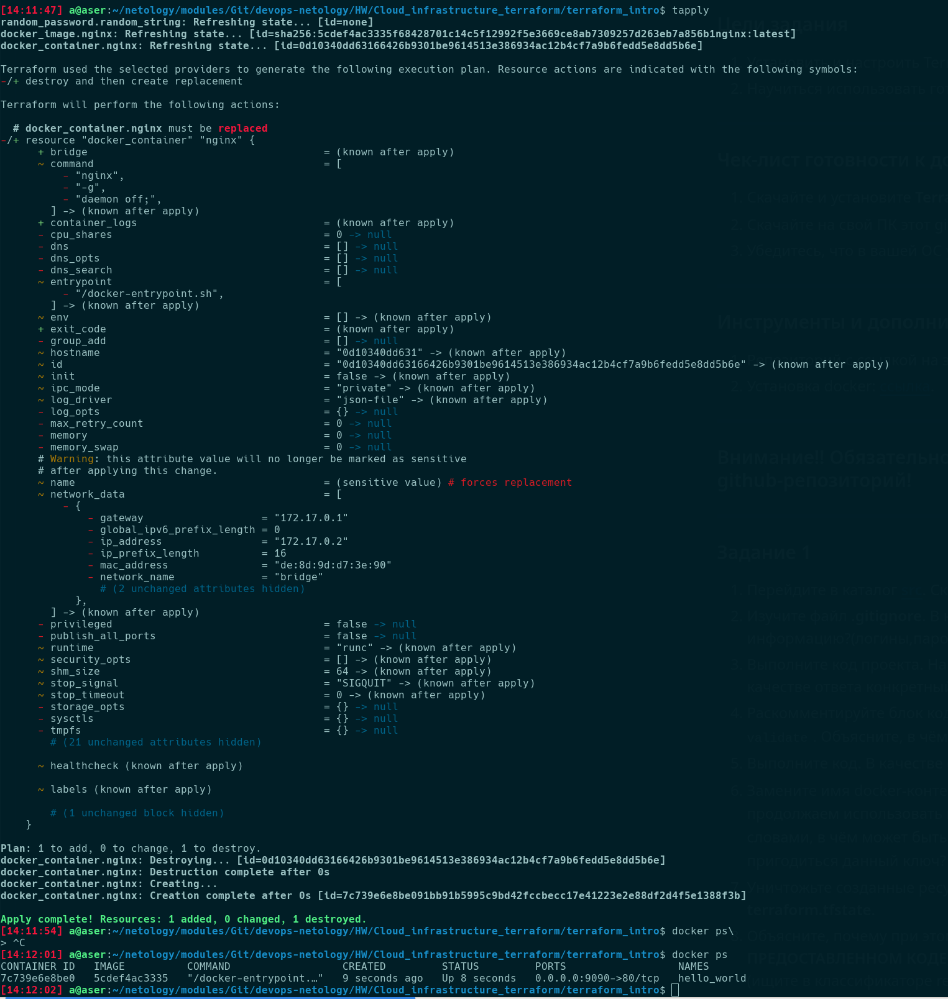
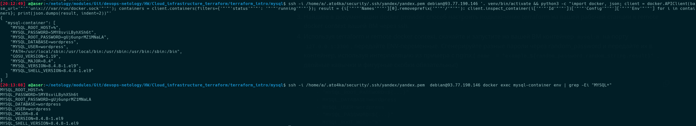
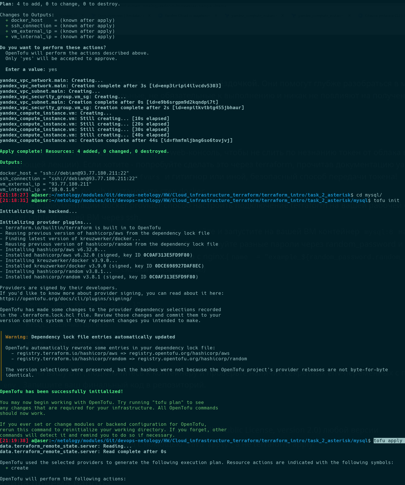

# Облачная инфраструктура. Terraform

<details>
<summary>1. Введение в Terraform</summary>

## Задание 1

[Директория с main.tf](terraform_intro/)



Согласно этому [.gitignore](https://raw.githubusercontent.com/netology-code/ter-homeworks/4730505f991c173ff42f44d7cffaa7366041e2f7/01/src/.gitignore), в файле под названием `personal.auto.tfvars` допустимо сохранить личную, секретную информацию (логины, пароли, ключи, токены и т.д).

Поскольку в раскомментированном блоке кода `main.tf` содержится тип ресурса без указания его наименования, а  также неверно поименованный ресурс.



Опасность -auto-approve заключается

- при добавлении новых ресурсов отсутствие плана не позволяет понять, что происходит удаление и пересоздание других ресурсов, приведет к потере доступности ресурса (опасно наличие записи will be replaced)
- при планировании наглядно отображается что будет destroy, и create
- не отображаются обновления ресурсов, которые были внесены до этого
- вероятность частичного создания инфраструктуры
- возникновение ошибок при наличии любых интерактивных скриптов (например, *.expect) (требующих взаимодействия с пользователем через терминал)



Лучшими практиками при выполнении plan \ apply в разных папках\окружениях и т.п. будет обеспечение консистентности хранилища провайдеров\версий .terraform.lock.hcl путем принудительного указания `terraform init -lockfile=readonly` как перед `terraform plan` (или, лучше `terraform plan -out=tfplan`) так и перед  `terraform apply`, в том числе и при использовании `-auto-approve`.

Содержимое файла terraform.tfstate:

```json
{
  "version": 4,
  "terraform_version": "1.12.1",
  "serial": 100,
  "lineage": "955ce0e9-a08d-ffdd-4be5-1a507e124360",
  "outputs": {},
  "resources": [],
  "check_results": null
}
```

При удалении ресурсов docker image будет сохраняться локально, поскольку "keep_locally = true", а при указании обратного - удаляться, что следует из описания ресурса docker провайдера  `docker_image:

`• keep_locally (Boolean) If true, then the Docker image won't be deleted on destroy operation.`

## Задание 2

Проверка Env в remote docker context на созданной ВМ:



## Задание 3

Opentofu init \ apply в yandex и docker remote директориях:


</details>

<details>
<summary>02. Основы Terraform. Yandex Cloud</summary>

## Задание 1

В коде были выявлены следующие синтактические ошибки:
• неверно поименована переменная vms_ssh_root_keу, заменяется на требуюмую в Задании 1 vms_ssh_public_root_key
• число ядер к 'yandex cloud' может быть минимально 2, при значении дробной части  процента (минимально 20%)
• необходимо указать  дефолтные значения yc cloud_id/fodler_id
• невеорно
• неверный  platform_id, 'standart-v4' -> 'standatd-v3'.
Опции Preemptable = true и использьвание 20%  CPU позволяет экономить денежные средства, уменьшая их потребление путем снижения как платы за CPU, так и позволяя автоматически выключать неиспользуемую виртуальную машину, снижая расход до нуля.  


## Задание 2-4


## Задание 5-6

Задание выполнено коде папки `terraform_basics`

### Задание 7*


### Задание 8*


### Задание 9*


</details>

