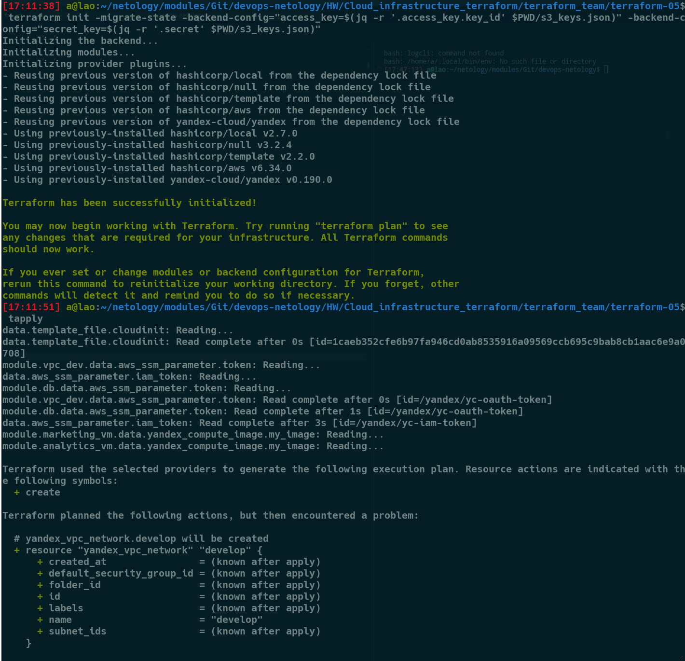
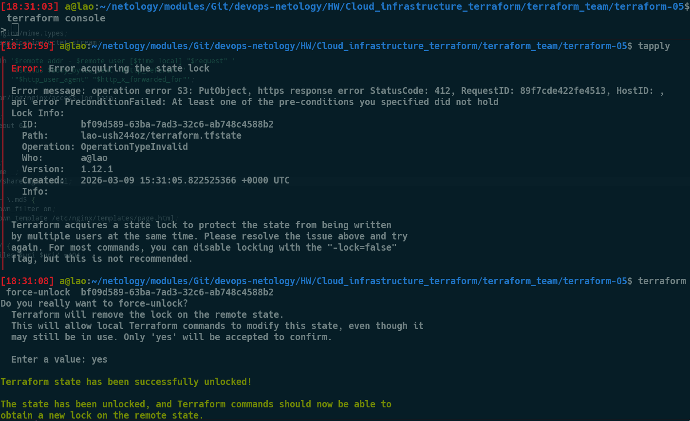
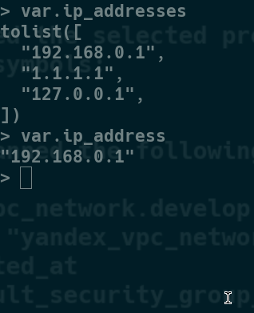
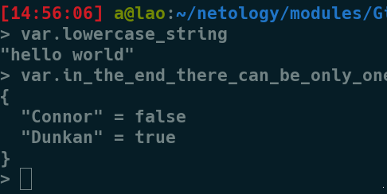
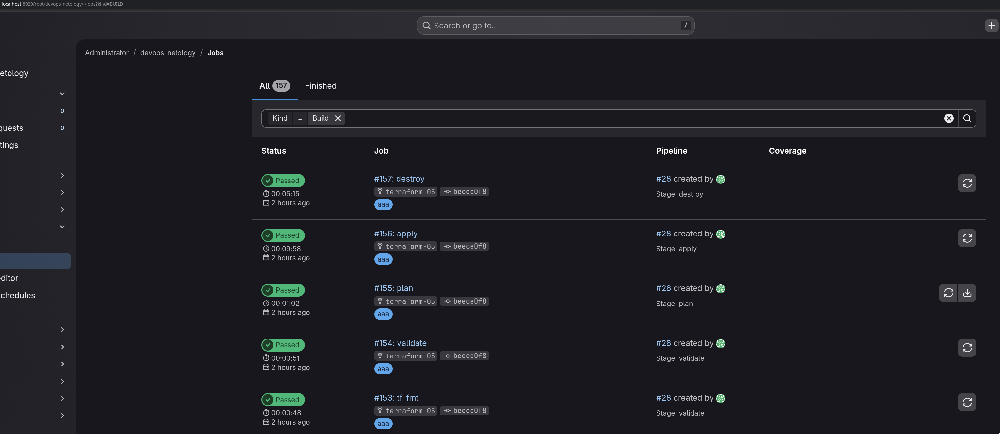
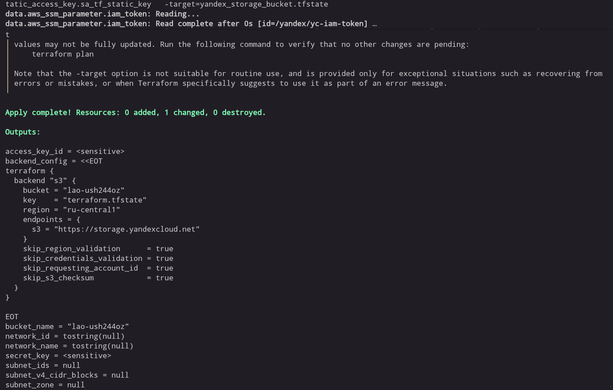

# Облачная инфраструктура. Terraform

<details>
<summary>1. Введение в Terraform</summary>

## Задание 1

[Директория с main.tf](terraform_intro/)


Согласно этому [.gitignore](https://raw.githubusercontent.com/netology-code/ter-homeworks/4730505f991c173ff42f44d7cffaa7366041e2f7/01/src/.gitignore), в файле под названием `personal.auto.tfvars` допустимо сохранить личную, секретную информацию (логины, пароли, ключи, токены и т.д).

Поскольку в раскомментированном блоке кода `main.tf` содержится тип ресурса без указания его наименования, а  также неверно поименованный ресурс.


Опасность -auto-approve заключается

- при добавлении новых ресурсов отсутствие плана не позволяет понять, что происходит удаление и пересоздание других ресурсов, приведет к потере доступности ресурса (опасно наличие записи will be replaced)
- при планировании наглядно отображается что будет destroy, и create
- не отображаются обновления ресурсов, которые были внесены до этого
- вероятность частичного создания инфраструктуры
- возникновение ошибок при наличии любых интерактивных скриптов (например, *.expect) (требующих взаимодействия с пользователем через терминал)


Лучшими практиками при выполнении plan \ apply в разных папках\окружениях и т.п. будет обеспечение консистентности хранилища провайдеров\версий .terraform.lock.hcl путем принудительного указания `terraform init -lockfile=readonly` как перед `terraform plan` (или, лучше `terraform plan -out=tfplan`) так и перед  `terraform apply`, в том числе и при использовании `-auto-approve`.

Содержимое файла terraform.tfstate:

```json
{
  "version": 4,w
  "terraform_version": "1.12.1",
  "serial": 100,
  "lineage": "955ce0e9-a08d-ffdd-4be5-1a507e124360",
  "outputs": {},
  "resources": [],
  "check_results": null
}
```
При удалении ресурсов docker image будет сохраняться локально, поскольку "keep_locally = true", а при указании обратного - удаляться, что следует из описания ресурса docker провайдера  `docker_image:

`• keep_locally (Boolean) If true, then the Docker image won't be deleted on destroy operation.`

## Задание 2

Проверка Env в remote docker context на созданной ВМ:


## Задание 3

Opentofu init \ apply в yandex и docker remote директориях:


</details>

<details>
<summary>02. Основы Terraform. Yandex Cloud</summary>

## Задание 1

В коде были выявлены следующие синтаксические ошибки:

- неверно поименована переменная vms_ssh_root_keу, заменяется на требуемую в Задании 1 vms_ssh_public_root_key
- число ядер к 'yandex cloud' может быть минимально 2, при значении дробной части  процента (минимально 20%)
- необходимо указать  дефолтные значения yc cloud_id/fodler_id,
- неверный  platform_id ('standart-v4' -> 'standatd-v3')

Опции Preemptable = true и использьвание 20% CPU позволяет экономить денежные средства, уменьшая их потребление путем снижения как платы за CPU, так и позволяя автоматически выключать неиспользуемую виртуальную машину, снижая расход до нуля


## Задание 2-4


## Задание 5-6

Задание выполнено в коде папки `terraform_basics`

### Задание 7*


### Задание 8*


### Задание 9*


</details>

<details>
<summary>03. Управляющие конструкции в коде Terraform Основы Terraform.</summary>

### Задание 1


### Задания 2-4


### Заданиe 5*


### Заданиe 5*


### Заданиe 6*


### Заданиe 7*

Решение находится в папке `terraform_control_constructs/terraform-03/task_7_asterisk`


### Заданиe 8*

Решение находится  в `terraform_control_constructs/task_6_asterisk/hosts.tftpl`

### Заданиe 9*


</details>

<details>
<summary>Продвинутые методы работы с Terraform</summary>


### Задание 1


------

### Задание 2


[Terraform-docs/task_1/04/demonstration1/vms](terraform_advanced/task_1/04/demonstration1/vms/README.md)

### Задание 3

```shell
terraform state list
terraform state rm module.vpc_dev
terraform state rm module.analytics_vm
terraform state rm module.marketing_vm
terraform import 'module.vpc_dev.yandex_vpc_network.vpc_dev' enptj5q7du6mns1jrtp4
terraform import 'module.vpc_dev.yandex_vpc_subnet.vpc_dev["vpc_dev_a"]' e9b1mr8ethmbcrd0i0l8
terraform import 'module.vpc_dev.yandex_vpc_subnet.vpc_dev["vpc_dev_b"]' e2l7lm9dro2cl2u9fu8o
terraform import 'module.vpc_dev.yandex_vpc_security_group.vpc_dev' enpmlficq4197va4pqie
terraform import 'module.analytics_vm.yandex_compute_instance.vm[0]' fhmq3lbjlmr4mja5n1lb
terraform import 'module.marketing_vm.yandex_compute_instance.vm[0]' fhmhc8e9ark38egdfjir
terraform import 'module.marketing_vm.yandex_compute_instance.vm[1]' epd7cac0sh8vi0udkrf3
```


## Дополнительные задания (со звёздочкой*)

**Настоятельно рекомендуем выполнять все задания со звёздочкой.**   Они помогут глубже разобраться в материале.
Задания со звёздочкой дополнительные, не обязательные к выполнению и никак не повлияют на получение вами зачёта по этому домашнему заданию.


### Задание 4*

```HCL
# CHILD main.tf
data "yandex_client_config" "client" {}

resource "yandex_vpc_network" "vpc_dev" {
  name      = "vpc-${var.env_name}"
  folder_id = data.yandex_client_config.client.folder_id
}

resource "yandex_vpc_subnet" "vpc_dev" {
  for_each       = var.subnets
  name           = "vpc_${var.env_name}-${each.key}"
  folder_id      = data.yandex_client_config.client.folder_id
  network_id     = yandex_vpc_network.vpc_dev.id
  zone           = each.value.zone
  v4_cidr_blocks = [each.value.v4_cidr_blocks]
}

resource "yandex_vpc_security_group" "vpc_dev" {
  name       = "vpc_${var.env_name}-sg"
  network_id = yandex_vpc_network.vpc_dev.id
  folder_id  = data.yandex_client_config.client.folder_id

  ingress {
    protocol       = "ANY"
    v4_cidr_blocks = ["0.0.0.0/0"]
  }

  egress {
    protocol       = "ANY"
    v4_cidr_blocks = ["0.0.0.0/0"]
  }
}
```

```HCL
# parent child.tf
module "vpc_dev" {
  source = "./vpc_dev"

  cloud_id     = var.cloud_id
  folder_id    = var.folder_id
  default_zone = var.default_zone
  env_name     = "develop"
}

module "vpc_prod" {
  source = "./vpc_dev"

  cloud_id     = var.cloud_id
  folder_id    = var.folder_id
  default_zone = var.default_zone
  env_name     = "production"
}

output "network_name" {
  value = module.vpc_dev.network_name
}

output "network_id" {
  value = module.vpc_dev.network_id
}

output "subnet_zone" {
  value = module.vpc_dev.subnet_zone
}

output "subnet_v4_cidr_blocks" {
  value = module.vpc_dev.subnet_v4_cidr_blocks
}

output "subnet_ids" {
  value = module.vpc_dev.subnet_ids
}
```
`terraform plan`

```
data.template_file.cloudinit: Reading...
data.template_file.cloudinit: Read complete after 0s [id=19ab2dda820c530557c6feb2be1fa6ac345bbf75bfc7e1a5f54a7769f4bcc7f3]
data.aws_ssm_parameter.token: Reading...
module.vpc_prod.data.aws_ssm_parameter.token: Reading...
module.vpc_dev.data.aws_ssm_parameter.token: Reading...
module.vpc_dev.data.aws_ssm_parameter.token: Read complete after 0s [id=/yandex/yc-oauth-token]
data.aws_ssm_parameter.token: Read complete after 0s [id=/yandex/yc-oauth-token]
module.vpc_prod.data.aws_ssm_parameter.token: Read complete after 0s [id=/yandex/yc-oauth-token]
module.analytics_vm.data.yandex_compute_image.my_image: Reading...
module.marketing_vm.data.yandex_compute_image.my_image: Reading...
module.vpc_dev.data.yandex_client_config.client: Reading...
module.vpc_dev.data.yandex_client_config.client: Read complete after 0s [id=2748697577]
module.vpc_prod.data.yandex_client_config.client: Reading...
module.vpc_prod.data.yandex_client_config.client: Read complete after 0s [id=2748697577]
module.marketing_vm.data.yandex_compute_image.my_image: Read complete after 1s [id=fd835npr436ep5g144gq]
module.analytics_vm.data.yandex_compute_image.my_image: Read complete after 1s [id=fd835npr436ep5g144gq]

Terraform used the selected providers to generate the following execution plan. Resource actions are indicated with the following symbols:
  + create

Terraform will perform the following actions:

  # local_file.hosts_ini will be created
  + resource "local_file" "hosts_ini" {
      + content              = (known after apply)
      + content_base64sha256 = (known after apply)
      + content_base64sha512 = (known after apply)
      + content_md5          = (known after apply)
      + content_sha1         = (known after apply)
   ...
Changes to Outputs:
  + analytics_vm_instances = [
      + {
          + external_ip = (known after apply)
          + fqdn        = (known after apply)
          + name        = "stage-web-stage-0"
        },
    ]
  + marketing_vm_instances = [
      + {
          + external_ip = (known after apply)
          + fqdn        = (known after apply)
          + name        = "develop-webs-0"
        },
      + {
          + external_ip = (known after apply)
          + fqdn        = (known after apply)
          + name        = "develop-webs-1"
        },
    ]
  + network_id             = (known after apply)
  + network_name           = "vpc-develop"
  + out                    = [
      + (known after apply),
      + (known after apply),
      + (known after apply),
    ]
  + subnet_ids             = [
      + (known after apply),
      + (known after apply),
    ]
  + subnet_v4_cidr_blocks  = {
      + vpc_dev_a = [
          + "10.0.1.0/24",
        ]
      + vpc_dev_b = [
          + "10.0.3.0/24",
        ]
    }
  + subnet_zone            = {
      + vpc_dev_a = "ru-central1-a"
      + vpc_dev_b = "ru-central1-b"
    }
  ```

```shell
$ yc compute instance list --format json | jq -r '.[] | "\(.name) \(.zone_id) \(.id) \(.status)"'
develop-webs-1 ru-central1-b epd9bfueiuke8rr931cf RUNNING
stage-web-stage-0 ru-central1-a fhmfhpnh3jk398dbisrv RUNNING
develop-webs-0 ru-central1-a fhmhkl0si359stsebd16 RUNNING
```
### Задание 5*


### Задание 6*


### Задание 7*


### Задание 8*


</details>

<details>
<summary>05. Использование Terraform в команде</summary>

### Задание 1

1. Возьмите код:
- при проверке [ДЗ к лекции 4](https://github.com/netology-code/ter-homeworks/tree/main/04/src) checkov и tflint уязвимостей или предупреждений выявлено не было.
- при [демо к лекции 4](https://github.com/netology-code/ter-homeworks/tree/main/04/demonstration1) выявлено следующее:

### Проверка TFLint

| Тип ошибки | Описание | Файл/строка | Статус |
|---|---|---|---|
| terraform_required_providers | Отсутствует ограничение версии для провайдера "yandex" в `required_providers` | providers.tf:3 |  Предупреждение |
| terraform_unused_declarations | Переменная "vms_ssh_root_key" объявлена, но не используется | variables.tf:36 |  Исправляемо |
| terraform_unused_declarations | Переменная "vm_web_name" объявлена, но не используется | variables.tf:43 |  Исправляемо |
| terraform_unused_declarations | Переменная "vm_db_name" объявлена, но не используется | variables.tf:50 |  Исправляемо |

### Проверка Checkov (демонстрация 4)

| Тип проверки | Описание | Ресурс | Файл/строка | Статус |
|---|---|---|---|---|
| CKV_TF_1 | Убедитесь, что источники модулей Terraform используют хеш коммита | test-vm | vms/main.tf:22-43 |  Ошибка |
| CKV_TF_2 | Убедитесь, что источники модулей Terraform используют тег с номером версии | test-vm | vms/main.tf:22-43 |  Ошибка |
| CKV_TF_1 | Убедитесь, что источники модулей Terraform используют хеш коммита | example-vm | vms/main.tf:45-61 |  Ошибка |
| CKV_TF_2 | Убедитесь, что источники модулей Terraform используют тег с номером версии | example-vm | vms/main.tf:45-61 | Ошибка |

**Проблема:** Модули используют `?ref=main` вместо конкретного хеша коммита или версии тега.

### Задание 2





### Задание 3

[PR request]https://github.com/slateeho/devops-netology/pull/2

### Задание 4




### Задание 5*



### Задание 6*

[Local Gitlab CI/CD Pipeline](terraform_team/task_6/.gitlab-ci.yml)



### Задание 7*



</details>
