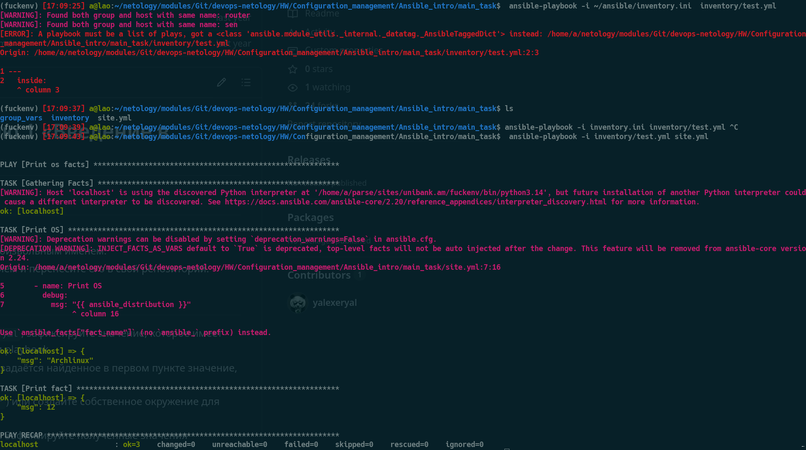
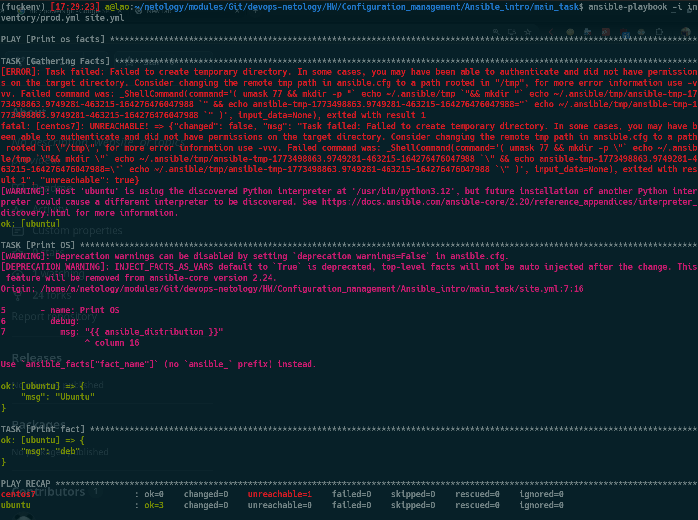
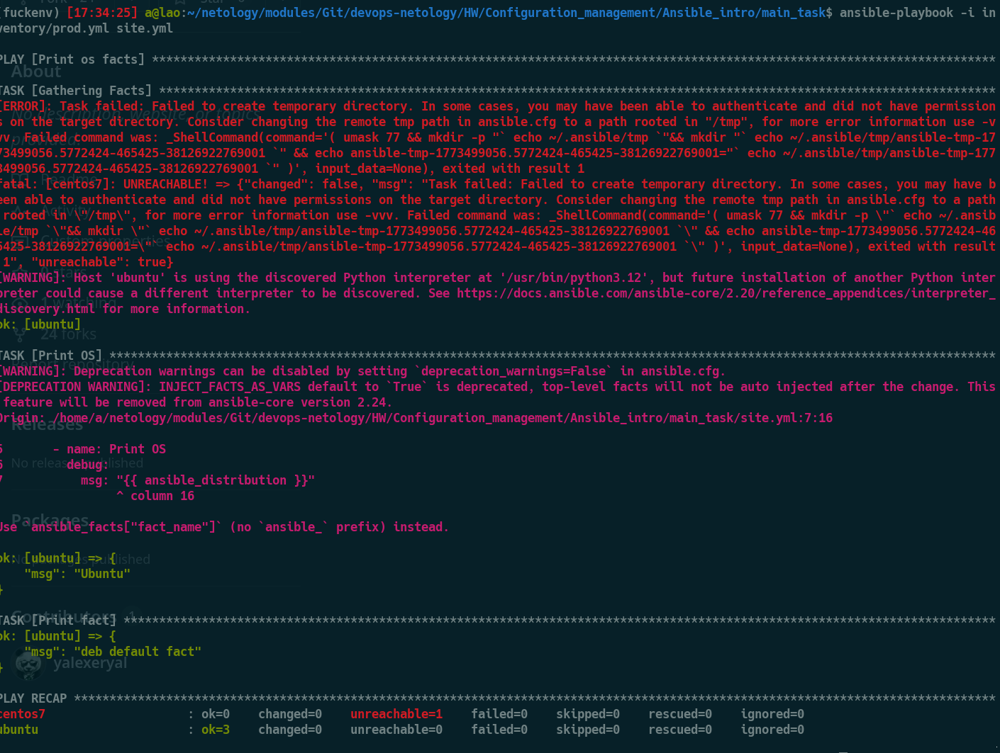
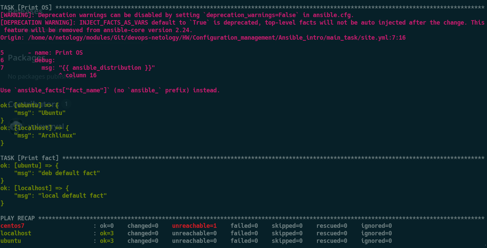

# Система управления конфигурациями

1. Введение в Ansible

# Основная часть

# Необязательная часть

- [Скрипт на bash](./Ansible_intro/additional_task/install_python_logged.sh)
- [Скрипт на Python](./Ansible_intro/additional_task/install_python_logged.py)

