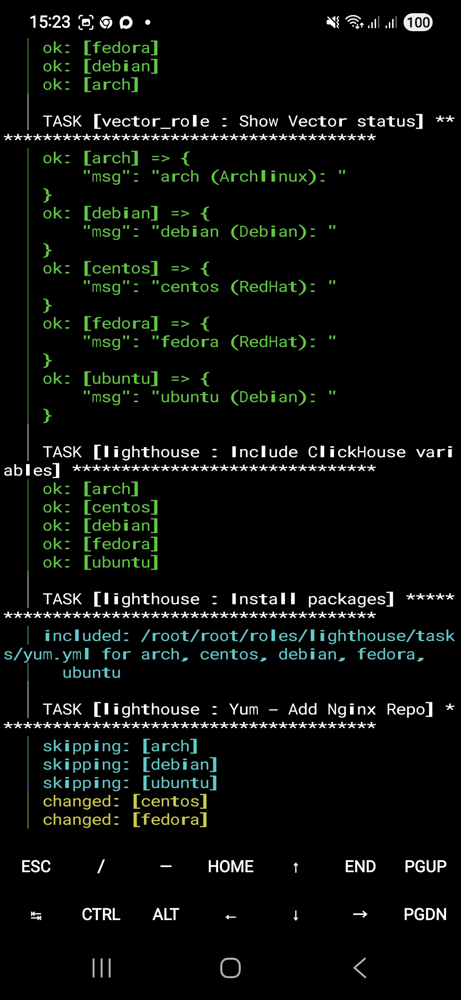
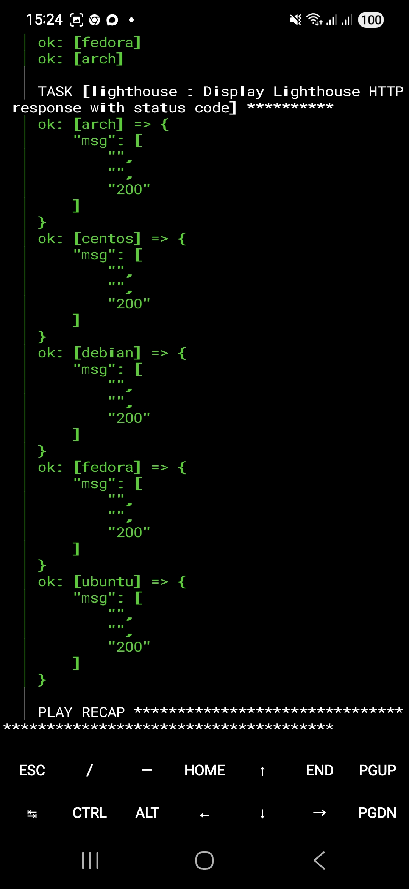
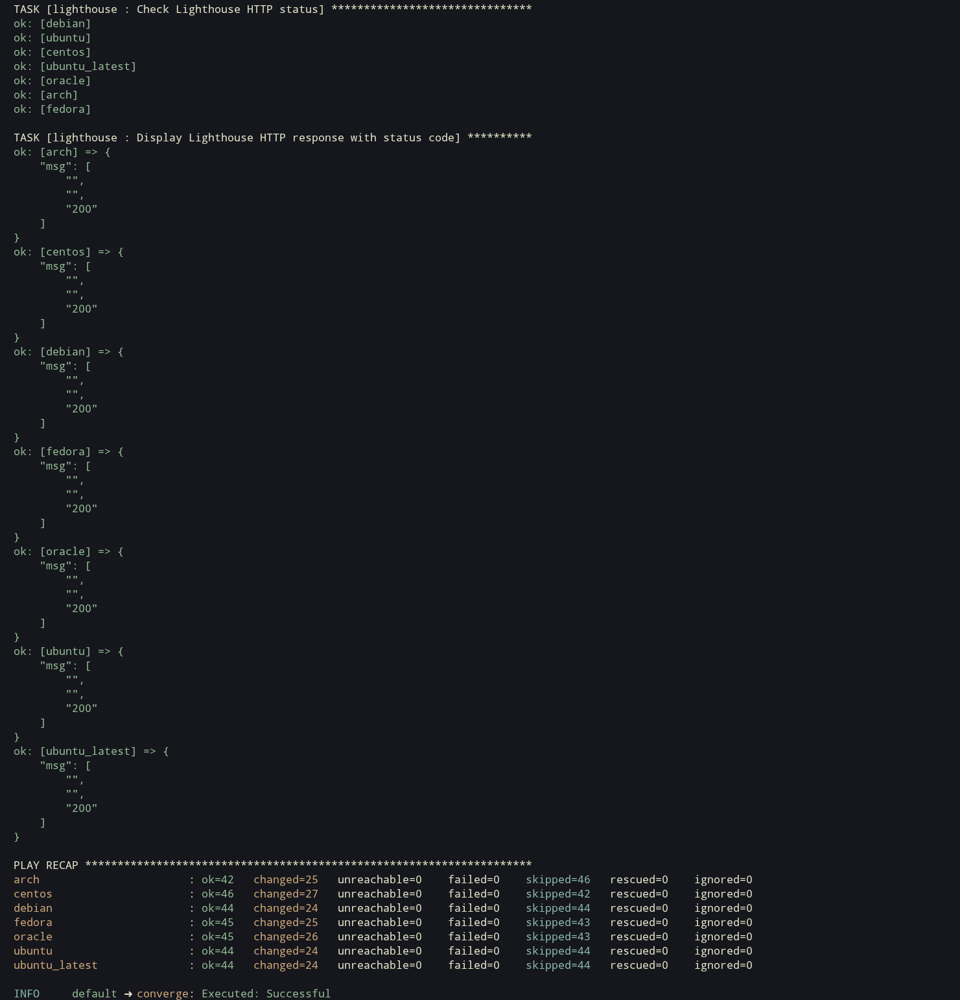
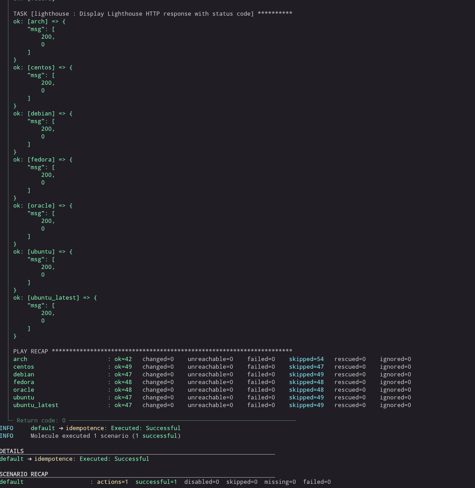

# Система управления конфигурациями

1. Введение в Ansible

# Основная часть

# Необязательная часть

- [Скрипт на bash](./Ansible_intro/additional_task/install_python_logged.sh)
- [Скрипт на Python](./Ansible_intro/additional_task/install_python_logged.py)

2. Работа с Playbook 

# Основная часть

[README.md по ролям `Clickhouse` и  `Vector`](Ansible_playbook/main_task/README.md)

3. Использование Ansible

# Основная часть

[README.md по ролям `Clickhouse` + `Lighthouse` и `Vector`](Ansible_use/main_task/README.md)

[08-ansible-03-yandex tag](https://github.com/slateeho/devops-netology/releases/tag/08-ansible-03-yandex)

4. Работа с Roles

# Основная часть

[README.md по ролям `Clickhouse` + `Lighthouse` и `Vector`](Ansible_roles/main_task/README.md)

Результат выполнения `molecule test`:

[v1.0.3](https://github.com/slateeho/devops-netology/releases/tag/v1.0.3)

[v1.0.4](https://github.com/slateeho/devops-netology/releases/tag/v1.0.4)

5. Тестирование Roles

# Основная часть

[README.md по ролям `Clickhouse` + `Lighthouse` и `Vector`](Ansible_roles/main_task/README.md)

Результат выполнения `molecule converge`:

Результат выполнения `molecule idempotence`:

Результат выполнения `molecule verify`:

[v1.0.5](https://github.com/slateeho/devops-netology/releases/tag/v1.0.5)

