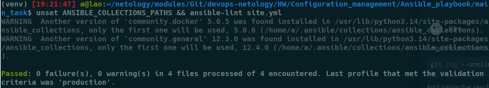
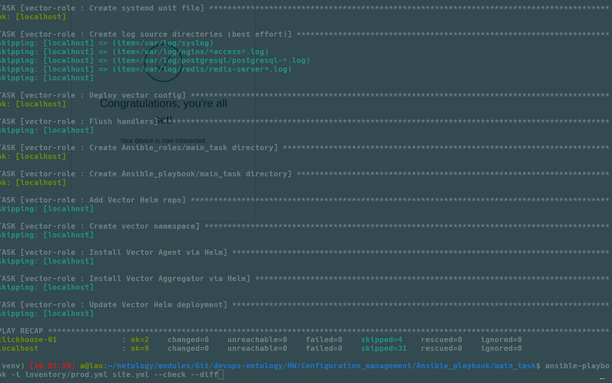
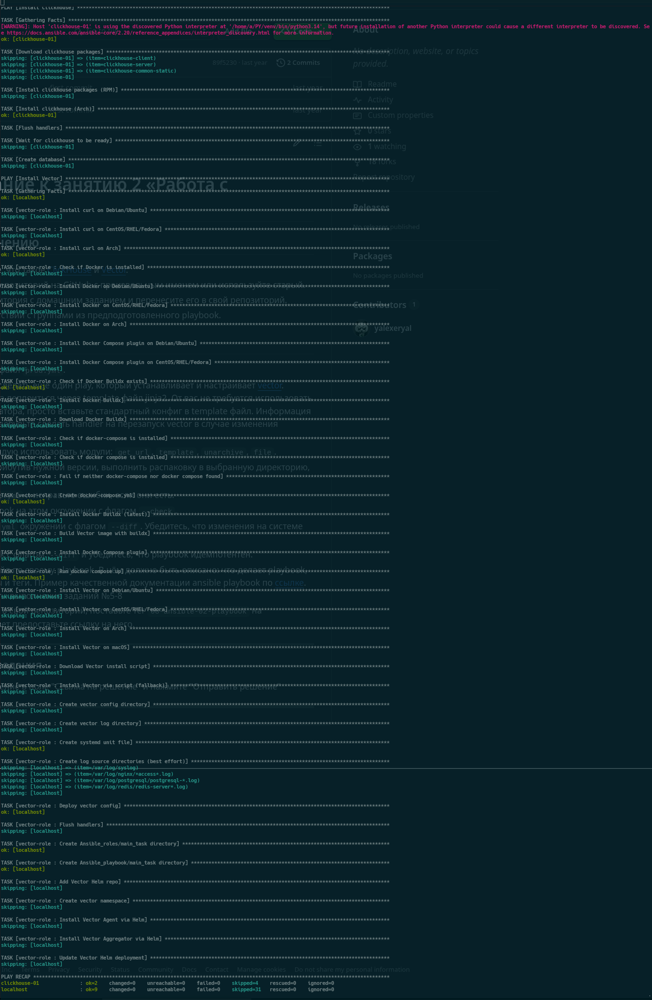
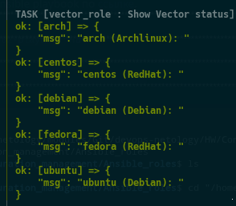
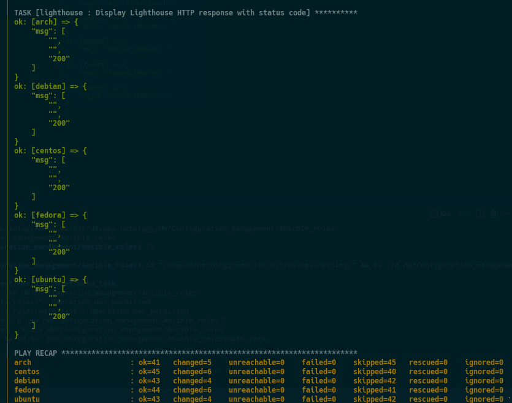

# Система управления конфигурациями

1. Введение в Ansible

# Основная часть

# Необязательная часть

- [Скрипт на bash](./Ansible_intro/additional_task/install_python_logged.sh)
- [Скрипт на Python](./Ansible_intro/additional_task/install_python_logged.py)

2. Работа с Playbook 

# Основная часть

[README.md по ролям `Clickhouse` и  `Vector`](Ansible_playbook/main_task/README.md)

3. Использование Ansible

# Основная часть

[README.md по ролям `Clickhouse` + `Lighthouse` и `Vector`](Ansible_use/main_task/README.md)

[08-ansible-03-yandex tag](https://github.com/slateeho/devops-netology/releases/tag/08-ansible-03-yandex)

3. Работа с Roles

# Основная часть

[README.md по ролям `Clickhouse` + `Lighthouse` и `Vector`](Ansible_roles/main_task/README.md)

[v.1.0.3](https://github.com/slateeho/devops-netology/commit/657c0dc3954516b7d7ed849b67e250d721d360b3)

