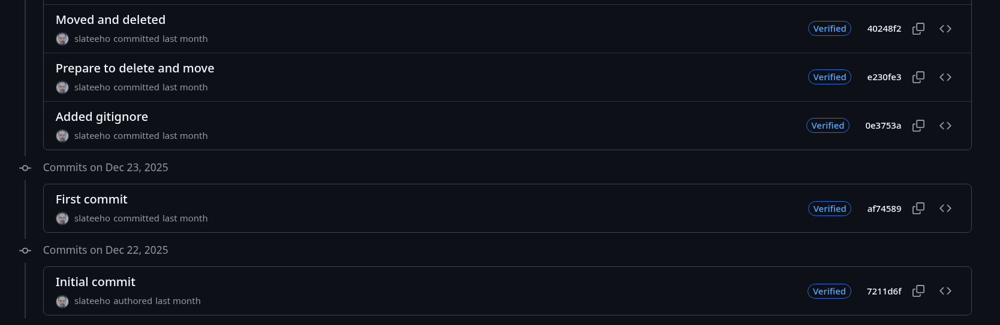

# Git и системы контроля версий

Домашнее задание к занятию «2.1. Системы контроля версий»

Домашнее задание к занятию «2.2. Основы Git»

### .gitignore содержит следующие правила игнорирования:

#### Директории
- `.terraform/` — будет игнорироваться директория с именем `.terraform` и все её содержимое

#### Файлы с расширениями
- `*.tfstate` — игнорируются все файлы с расширением `.tfstate` (`*` - любая последовательность символов)
- `*.tfstate.*` — игнорируются все файлы, начинающиеся с любых символов, содержат `.tfstate.`, а затем любые символы
- `*.tfvars` — будут игнорироваться все файлы с расширением `.tfvars`
- `*.tfvars.json` — будут игнорироваться все файлы с расширением `.tfvars.json`

#### Конкретные файлы
- `.terraform.tfstate.lock.info` — игнорируемый файл с точным именем `.terraform.tfstate.lock.info`
- `override.tf` — игнорирование файла с точным именем `override.tf`
- `override.tf.json` — с точным именем `override.tf.json`
- `.terraformrc` — будет игнорироваться файл с точным именем `.terraformrc`
- `terraform.rc` — будет игнорироваться файл с точным именем `terraform.rc`

#### Файлы с паттернами
- `*_override.tf` — будут игнорироваться все файлы, которые заканчиваются на `_override.tf` (символ `*` в начале означает любую последовательность символов)
- `*_override.tf.json` — будут игнорироваться все файлы, которые заканчиваются на `_override.tf.json`

### Ссылки на репозитории

#### GitHub
https://github.com/slateeho/devops-netology

#### GitLab  
https://gitlab.com/slateeho/devops-netology

#### Bitbucket
https://bitbucket.org/slateeho/devops-netology

Домашнее задание к занятию «2.3. Ветвления в Git»

### Граф коммитов
https://github.com/slateeho/devops-netology/network

Домашнее задание к занятию «2.4. Инструменты Git»

### 1. Какому тегу соответствует коммит 85024d3?
v0.12.23 (первый тег, содержащий этот коммит)

### 2. Сколько родителей у коммита b8d720? Напишите их хеши.
2 родителя:
- 56cd7859e05c36c06b56d013b55a252d0bb7e158
- 9ea88f22fc6269854151c571162c5bcf958bee2b

### 3. Перечислите хеши и комментарии всех коммитов, которые были сделаны между тегами v0.12.23 и v0.12.24.
- 33ff1c03bb v0.12.24
- b14b74c493 [Website] vmc provider links
- 3f235065b9 Update CHANGELOG.md
- 6ae64e247b registry: Fix panic when server is unreachable
- 5c619ca1ba website: Remove links to the getting started guide's old location
- 06275647e2 Update CHANGELOG.md
- d5f9411f51 command: Fix bug when using terraform login on Windows
- 4b6d06cc5d Update CHANGELOG.md
- dd01a35078 Update CHANGELOG.md
- 225466bc3e Cleanup after v0.12.23 release

### 4. Найдите коммит, в котором была создана функция func providerSource (с аргументами вместо многоточия).
5af1e6234ab6da412fb8637393c5a17a1b293663 (два позиционных параметра: configs []*cliconfig.ProviderInstallation, services *disco.Disco)

### 5. Найдите все коммиты, в которых была изменена функция globalPluginDirs.
- 35a058fb3d (использование функции)
- c0b1761096 (изменение функции)
- 7c4aeac5f3 (перенос функции в другой пакет)

### 6. Кто автор функции synchronizedWriters?
Martin Atkins

