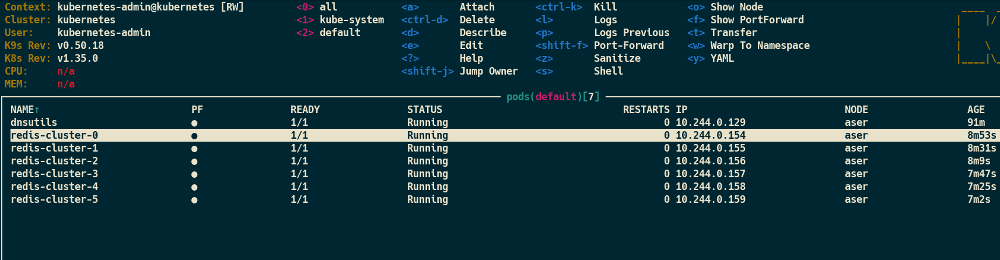
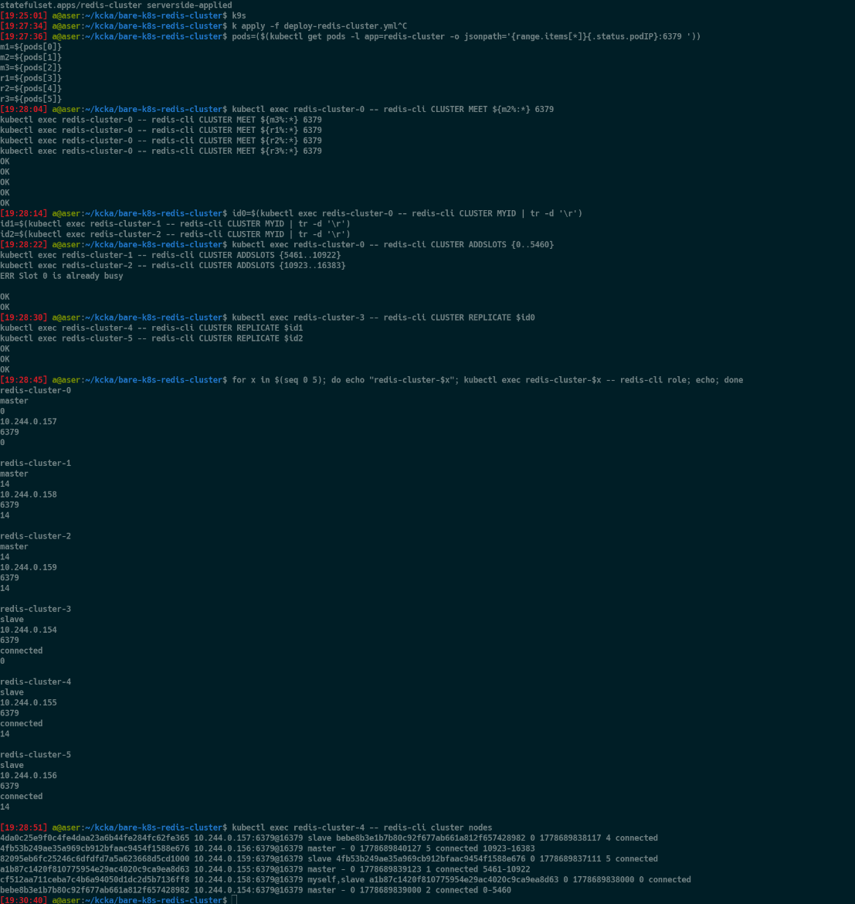

# Микросервисы

<details>
<summary>1. Микросервисы: принципы</summary>

## Задача 1 – API Gateway

### Сравнительная таблица

| Решение        | Маршрутизация | Проверка аутентификации                 | Терминация HTTPS | Расширяемость                | Простота эксплуатации | Примечание |
|----------------|---------------|------------------------------------------|------------------|------------------------------|------------------------|------------|
| **NGINX**      | Да            | Да (auth_request, Lua)                   | Да               | Модули, Lua                  | Просто                | Лёгкий, стабильный, идеален для Docker/VM, подходит для кастомных схем аутентификации. |
| **Kong**       | Да            | Да (JWT, OAuth2, ACL, внешние авторизаторы) | Да           | Очень высокая (Lua плагины) | Средняя               | Зрелый OSS‑гейт, богатая экосистема, поддержка service discovery. |
| **KrakenD**    | Да            | Да (JWT, внешние валидаторы)            | Да               | Очень высокая (Go плагины)  | Средняя               | High‑performance gateway: stateless‑кластер, агрегация/трансформации, DNS SRV, etcd. |
| **Traefik**    | Да            | Да (middleware)                          | Да               | Плагины, динамическая конфигурация | Просто         | Отлично подходит для Docker/K8s, auto‑discovery сервисов. |
| **AWS API GW** | Да            | Да                                       | Да               | AWS экосистема               | Просто (облако)       | Управляемый сервис, идеален для serverless. |

**Выбор:** NGINX

**Обоснование:**
- Полностью удовлетворяет требованиям: маршрутизация, проверка аутентификации, терминация HTTPS
- Легковесный и стабильный
- Просто развернуть в Docker
- Поддерживает внешнюю аутентификацию через auth_request

---

## Задача 2 – Брокер сообщений

### Сравнительная таблица

| Брокер   | Кластеризация | Сохранение на диск | Скорость | Форматы | ACL | Простота |
|----------|---------------|--------------------|----------|---------|-----|----------|
| RabbitMQ | Да            | Да                 | Высокая  | Любые   | Да  | Просто   |
| Kafka    | Да            | Да                 | Очень высокая | Любые | Да  | Сложно   |
| NATS     | Да (JetStream)| Да                 | Очень высокая | Любые | Да  | Средне   |
| ActiveMQ | Да            | Да                 | Средняя  | Любые   | Да  | Средне   |

**Выбор:** RabbitMQ

**Обоснование:**
- Удовлетворяет всем требованиям
- Проще в эксплуатации чем Kafka
- Надёжная доставка сообщений
- Хорошая система ACL

---

## Задача 3 – API Gateway (NGINX + Docker Compose)

### docker-compose.yml

```yaml
version: "3.9"

services:
  gateway:
    image: nginx:alpine
    volumes:
      - ./nginx.conf:/etc/nginx/nginx.conf:ro
    ports:
      - "80:80"
    depends_on:
      - security
      - uploader
      - minio

  security:
    image: security-service:latest
    expose:
      - "8080"

  uploader:
    image: uploader-service:latest
    expose:
      - "8080"

  minio:
    image: minio/minio
    command: server /data --console-address ":9001"
    environment:
      MINIO_ROOT_USER: minio
      MINIO_ROOT_PASSWORD: minio123
    expose:
      - "9000"
      - "9001"
```

### nginx.conf

```nginx
worker_processes 1;

events {
  worker_connections 1024;
}

http {
  upstream security_service {
    server security:8080;
  }

  upstream uploader_service {
    server uploader:8080;
  }

  upstream minio_service {
    server minio:9000;
  }

  server {
    listen 80;

    # Аутентификация через subrequest
    location = /v1/auth {
      internal;
      proxy_pass http://security_service/v1/token/validation;
      proxy_pass_request_body off;
      proxy_set_header Content-Length "";
      proxy_set_header Authorization $http_authorization;
    }

    # Публичные эндпоинты
    location = /v1/register {
      proxy_pass http://security_service/v1/user;
    }

    location = /v1/token {
      proxy_pass http://security_service/v1/token;
    }

    # Защищённые эндпоинты
    location = /v1/user {
      auth_request /v1/auth;
      proxy_pass http://security_service/v1/user;
    }

    location = /v1/upload {
      auth_request /v1/auth;
      proxy_pass http://uploader_service/v1/upload;
    }

    location /v1/images/ {
      auth_request /v1/auth;
      proxy_pass http://minio_service;
    }
  }
}
```
</details>

<details>
<summary>2. Введение в микросервисы</summary>

## Выгоды перехода на микросервисную архитектуру

### 1. Масштабируемость и высокая доступность
Микросервисы позволяют масштабировать только те части системы, которые действительно испытывают нагрузку — каталог, корзину, оплату, поиск. Это снижает затраты и повышает устойчивость. Отказ одного сервиса не приводит к падению всего интернет‑магазина.

### 2. Гибкость технологий
Каждый сервис может использовать оптимальный стек технологий: разные языки, базы данных, фреймворки. Это снижает зависимость от одного технологического решения и позволяет быстрее внедрять новые инструменты.

### 3. Ускорение разработки и вывода новых функций
Команды могут работать независимо друг от друга. Обновление одного сервиса не требует релиза всей системы. Это сокращает time‑to‑market и уменьшает риски при внедрении изменений.

### 4. Улучшенная поддерживаемость и понимание системы
Кодовая база становится проще: каждый сервис отвечает за ограниченную бизнес‑функцию. Новым разработчикам легче погружаться в проект, а изменения — локализовать.

### 5. Эластичность и экономическая эффективность в облаке
Микросервисы хорошо сочетаются с облачными платформами: автоматическое масштабирование, гибкое распределение ресурсов, модель оплаты «по факту использования». Это снижает стоимость инфраструктуры и улучшает пользовательский опыт.

## Проблемы, которые нужно решить в первую очередь

### 1. Корректная декомпозиция монолита
Необходимо определить границы будущих сервисов. Ошибки приводят к чрезмерному количеству сетевых вызовов, росту задержек и сложности поддержки. Требуется анализ домена, данных и зависимостей.

### 2. Управление распределённостью
Микросервисы требуют новых инфраструктурных компонентов: сервис‑регистров, балансировщиков, механизмов отказоустойчивости, API‑шлюза. Без них система становится нестабильной и трудноуправляемой.

### 3. Наблюдаемость и мониторинг
Необходимо централизованное логирование, метрики, трассировка запросов. Без этого невозможно диагностировать проблемы в распределённой системе.

### 4. Автоматизация сборки и деплоя
Количество сервисов растёт, поэтому ручной деплой невозможен. Требуются CI/CD‑конвейеры, автоматические тесты, единые правила сборки и доставки артефактов.

### 5. Контейнеризация и оркестрация
Для стабильной работы микросервисов нужны контейнеры и оркестратор (например, Kubernetes). Это обеспечивает единообразие окружений, автоматическое восстановление сервисов и управление масштабированием.

### 6. Управление конфигурациями
Конфигурации должны храниться централизованно и обновляться без перезапуска сервисов. Это критично для стабильности и скорости изменений.

### 7. Перестройка процессов и команд
Переход к микросервисам требует DevOps‑культуры: кросс‑функциональных команд, ответственности за сервис «от разработки до эксплуатации», автоматизации и тесного взаимодействия разработки и эксплуатации.


</details>


<details>
<summary>3. Микросервисы: подходы</summary>

---

## Задача 1: Обеспечение процесса разработки (CI/CD)

**Выбор: GitLab CI**

| Требование | Реализация в GitLab CI |
|------------|------------------------|
| Облачная система | GitLab.com или self-hosted |
| Git + репозиторий на сервис | Встроенный Git + группы/проекты |
| Сборка по событию | Webhooks, merge request, push |
| Сборка по кнопке с параметрами | Manual triggers с variables |
| Настройки на сборку | CI/CD variables (pipeline, job level) |
| Шаблоны конфигураций | `.gitlab-ci.yml` с `include` |
| Безопасное хранение секретов | GitLab CI variables, Vault integration |
| Несколько конфигураций | Matrix jobs, rules |
| Кастомные шаги | Custom scripts, extensions |
| Свои докер-образы | Kaniko, Buildah, Docker executor |
| Агенты на своих серверах | GitLab Runner (self-hosted) |
| Параллельные сборки | Parallel jobs, matrix strategy |
| Параллельные тесты | `parallel` keyword, test splitting |

**Обоснование:** GitLab CI полностью покрывает все требования "из коробки": встроенный Git-репозиторий, CI/CD, реестр образов, Container Registry, Vault для секретов, и возможность подключения собственных раннеров.

---

## Задача 2: Сбор и анализ логов

**Выбор: ELK-стек (Elasticsearch + Logstash + Kibana)**

| Требование | Реализация |
|------------|------------|
| Сбор со всех хостов | Beats (Filebeat) или Fluentd |
| stdout | Децентрализованный сбор via agent |
| Гарантированная доставка | Beats persistent queue, retry |
| Поиск/фильтрация | Elasticsearch full-text |
| UI для разработчиков | Kibana с sharing links |
| Ссылка на сохранённый поиск | Kibana Saved Objects |

**Обоснование:** ELK — индустриальный стандарт с лучшим поиском (DSL).

---

## Задача 3: Мониторинг

**Выбор: Prometheus + Grafana**

| Требование | Реализация |
|------------|------------|
| Сбор метрик с хостов | node_exporter |
| Ресурсы хостов (CPU/RAM/HDD/Network) | node_exporter |
| Метрики сервисов | cAdvisor, приложения |
| Специфичные метрики сервисов | Custom exporters, /metrics endpoint |
| Запросы и агрегация | PromQL, Prometheus |
| Дашборды | Grafana |

**Обоснование:** Prometheus + Grafana — стандарт для cloud-native мониторинга.

---

## Задача 4: ELK + Vector (практика)

Файлы в директории `Approaches/`:
- [docker-compose-logs.yml](Approaches/docker-compose-logs.yml) — запуск Vector + Elasticsearch + Kibana
- [vector.toml](Approaches/vector.toml) — конфигурация Vector

Запуск: `docker compose -f docker-compose-logs.yml up -d`
Доступ: http://localhost:8081 (Kibana)
Логин: admin / qwerty123456

---

## Задача 5: Prometheus + Grafana (практика)

Файлы в директории `Approaches/`:
- [docker-compose-monitoring.yml](Approaches/docker-compose-monitoring.yml) — запуск Prometheus + Grafana
- [prometheus.yml](Approaches/prometheus.yml) — конфигурация scrape для security, uploader, storage
- [dashboards/dashboard.yml](Approaches/dashboards/dashboard.yml) — provisioning дашбордов
- [dashboards/requests-by-service.json](Approaches/dashboards/requests-by-service.json) — дашборд распределения запросов
- [datasources/datasources.yml](Approaches/datasources/datasources.yml) — подключение Prometheus

Запуск: `docker compose -f docker-compose-monitoring.yml up -d`
Доступ: http://localhost:8081 (Grafana)
Логин: admin / qwerty123456


</details>

<details>
<summary>4. Микросервисы: масштабирование</summary>

### Задача 1: Предложение по организации инфраструктуры

Выбранное решение: использование Kubernetes как основной платформы для запуска и масштабирования микросервисов. K8s обеспечивает контейнеризацию, сервис-дискавери, маршрутизацию, масштабирование и безопасное хранение конфигураций.

#### Компоненты решения

| Компонент | Назначение | Реализация требований |
|-----------|------------|------------------------|
| Kubernetes | Оркестрация контейнеров, управление подами | Контейнеры, масштабирование, сервис-дискавери |
| Service + Ingress | Внутренний DNS и внешняя маршрутизация | Обнаружение сервисов, HTTP/HTTPS маршрутизация |
| HPA | Автоматическое масштабирование подов | Масштабирование по CPU/Memory/метрикам |
| Cluster Autoscaler | Масштабирование узлов | Автоматическое добавление/удаление нод |
| Network Policies | Сетевое разделение | Ограничение трафика между сервисами |
| ConfigMap / Secret | Конфигурации и секреты | Переменные среды, безопасное хранение |
| RBAC | Контроль доступа | Ограничение прав на ресурсы |
| ETCD encryption | Шифрование данных | Защита секретов |
| CI/CD | Автоматизация сборки и деплоя | Доставка обновлений в кластер |
| Мониторинг (Prometheus/Grafana) | Метрики и алерты | Наблюдаемость и диагностика |

#### Соответствие требованиям

1. Поддержка контейнеров: Kubernetes запускает контейнеры через Pod, образы хранятся в registry.
2. Обнаружение сервисов: CoreDNS создаёт DNS-записи, доступ по имени сервиса. Внешний доступ через Ingress/Ingress Controller.
3. Горизонтальное масштабирование: изменение количества реплик подов в Deployment.
4. Автоматическое масштабирование: HPA регулирует количество подов, Cluster Autoscaler масштабирует ноды.
5. Разделение ресурсов: Network Policies, разные namespace, ограничение внешнего доступа через Ingress
6. Конфигурации и секреты: ConfigMap для обычных параметров, Secret для чувствительных данных, шифрование etcd, RBAC, Sealed Secrets или External Secrets.

Kubernetes выбран как наиболее зрелая и универсальная платформа, покрывающая все требования без дополнительных сложных решений.

### Разделение ресурсов — Namespaces vs. Отдельный кластер

| Критерий | Namespaces | Отдельный кластер |
|----------|-----------|-------------------|
| **Изоляция данных** | Логическая изоляция, данные хранятся в одном etcd | Полная физическая изоляция, свой etcd и control plane |
| **Ресурсы** | Общие для всех namespaces, можно задавать квоты | Выделенные, полностью независимые ресурсы |
| **Управление доступом** | RBAC работает на уровне namespace | Настраивается отдельно для каждого кластера |
| **Безопасность** | Подходит для команд внутри одной компании | Лучше для разных компаний или клиентов (SaaS) |
| **Стоимость и поддержка** | Дешевле: один control plane, меньше накладных расходов | Дороже: каждый кластер требует администрирования |
| **Гибкость настройки** | Ограничена рамками общего кластера | Максимальная: разные версии K8s, плагины, политики |
| **Применение** | Отделы внутри одной организации, разные окружения (dev/stage/prod) | Полная изоляция в финансовом секторе, госуслугах, multi-cloud |

---

### Задача 2: Распределённый кеш (Redis Cluster)

Необходим k8s кластер Redis из трёх шардов, у каждого по одной реплике. Итого 6 узлов. Реализация через StatefulSet+Service, c предварительно поднятым PV, определенным для каждого элемента кластера PVC.

```bash
kubectl apply -f default-sc.yml
kubectl apply -f pv.yml
kubectl apply -f pvc.yml
kubectl apply -f deploy-redis-cluster.yml
```
### Файлы конфигурации

- [default-sc.yml](Scaling/default-sc.yml) — StorageClass для динамического выделения томов
- [pv.yml](Scaling/pv.yml) — PersistentVolume для хранения данных Redis
- [pvc.yml](Scaling/pvc.yml) — PersistentVolumeClaim для запроса хранилища
- [deploy-redis-cluster.yml](Scaling/deploy-redis-cluster.yml) — Deployment Redis кластера

### Инициализация кластера

```shell
i=($(kubectl get pods -l app=redis-cluster -o jsonpath='{range.items[*]}{.status.podIP}:6379 '))

kubectl exec -it redis-cluster-0 -- redis-cli CLUSTER MEET ${i[1]%:*} 6379
kubectl exec -it redis-cluster-0 -- redis-cli CLUSTER MEET ${i[2]%:*} 6379
kubectl exec -it redis-cluster-0 -- redis-cli CLUSTER MEET ${i[3]%:*} 6379
kubectl exec -it redis-cluster-0 -- redis-cli CLUSTER MEET ${i[4]%:*} 6379
kubectl exec -it redis-cluster-0 -- redis-cli CLUSTER MEET ${i[5]%:*} 6379

i_m1=$(kubectl exec -it redis-cluster-0 -- redis-cli CLUSTER MYID)
i_m2=$(kubectl exec -it redis-cluster-1 -- redis-cli CLUSTER MYID)
i_m3=$(kubectl exec -it redis-cluster-2 -- redis-cli CLUSTER MYID)
v_r1=$(kubectl exec -it redis-cluster-3 -- redis-cli CLUSTER MYID)
v_r2=$(kubectl exec -it redis-cluster-4 -- redis-cli CLUSTER MYID)
v_r3=$(kubectl exec -it redis-cluster-5 -- redis-cli CLUSTER MYID)

kubectl exec -it redis-cluster-0 -- redis-cli CLUSTER ADDSLOTS {0..5460}
kubectl exec -it redis-cluster-1 -- redis-cli CLUSTER ADDSLOTS {5461..10922}
kubectl exec -it redis-cluster-2 -- redis-cli CLUSTER ADDSLOTS {10923..16383}

kubectl exec -it redis-cluster-3 -- redis-cli CLUSTER REPLICATE $i_m1
kubectl exec -it redis-cluster-4 -- redis-cli CLUSTER REPLICATE $i_m2
kubectl exec -it redis-cluster-5 -- redis-cli CLUSTER REPLICATE $i_m3
```


### Скриншоты кластера





</details>