# Мониторинг и логи

<details>
<summary>1. Средство визуализации Grafana</summary>

## Задание 1

утилизация CPU для nodeexporter (в процентах, 100-idle):

 `100 - (avg(rate(node_cpu_seconds_total{mode="idle"}[5m])) * 100)`

CPULA 1/5/15: `node_load1` `node_load5` `node_load15`

Количество свободной оперативной памяти; `{"node_memory_MemAvailable_bytes / 1024 / 1024 / 1024"}`

Количество места на файловой системе: `node_filesystem_avail_bytes{fstype!="tmpfs|devtmpfs|sshfs|squashfs|overlay"} / 1024 / 1024 / 1024` 

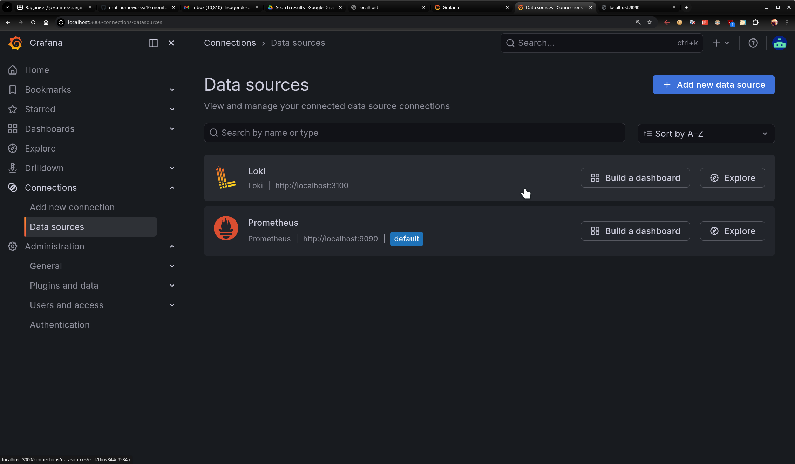

## Задание 2

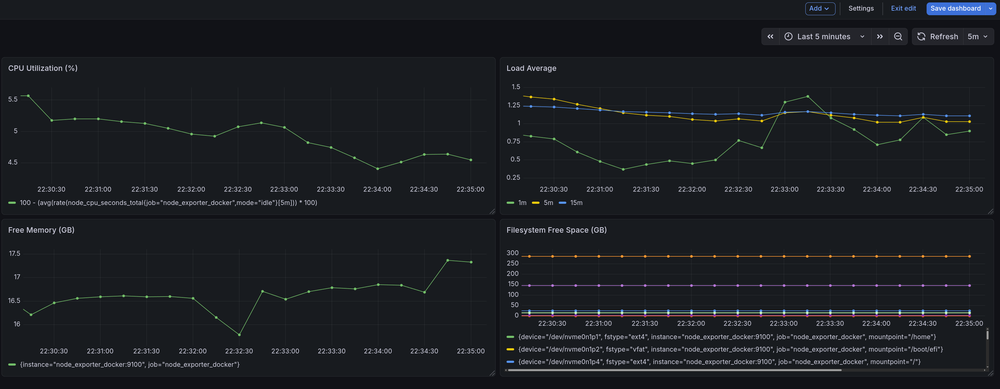

## Задание 3

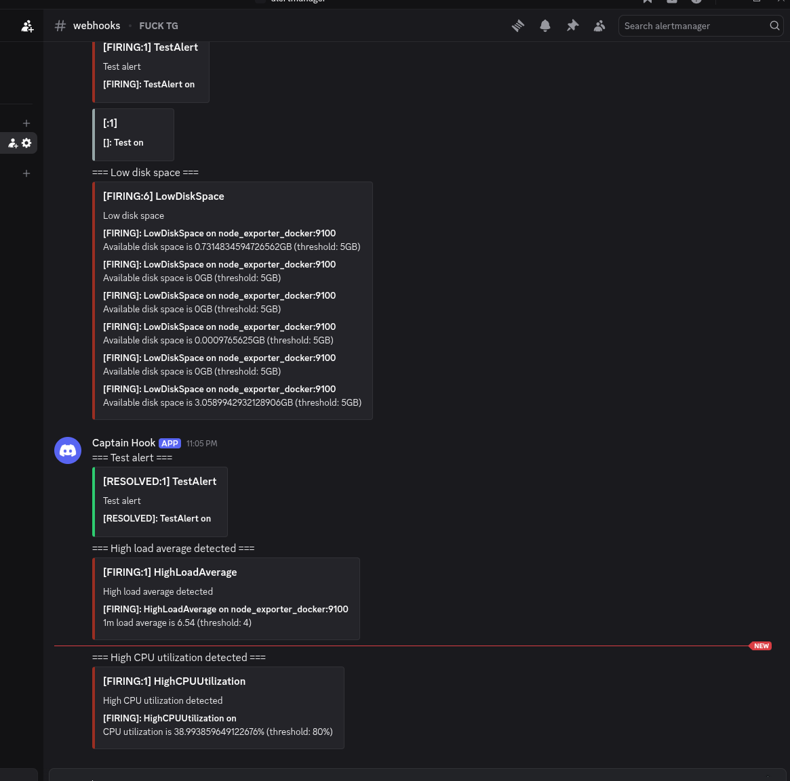

## Задание 4

[Dashboard JSON](./Grafana/netol2-dashboard.json)

</details>

<details>
<summary>2. Системы мониторинга</summary>

## Задание 1: Минимальный набор метрик для HTTP-сервиса с вычислениями

1. `http_request_duration_seconds{quantile="0.99"}` (alert > 2s)
2. `http_requests_total{status=~"5.."}` (rate > 1%)
3. `node_load1 / node_cpu_count` (alert > 1.5)
4. `node_memory_MemAvailable_bytes / node_memory_MemTotal_bytes` (alert < 10%)
5. `computation_duration_seconds{quantile="0.99"}` (alert > SLA)

## Задание 2: Что означают технические метрики для продакт-менеджера

**RAM (Оперативная память)**
- Как размер рабочего стола: если мало места → вы спотыкаетесь и роняете вещи
- Когда RAM заканчивается → сервис начинает жутко тормозить и падает (нехватка памяти = нарушение SLA = клиенты жалуются)

**Inodes (Индексные узлы)**
- Как количество пустых ячеек в шкафу для новых папок
- Когда inodes кончаются → нельзя создать новые файлы, даже если место на диске есть (логи/отчеты не сохраняются, а потеря данных ведет к потере клиентов)

**Load Average (Средняя нагрузка)**
Высокий CPU Load Average — это ситуация, когда комманда получает больше задач, чем может обработать (например, `при деплое pipeline в пятницу`), и в результате начинает срывать свои “дедлайны”

## Задание 3: Решение для разработчиков без системы логов

### Dozzle

Один контейнер, показывает логи всех контейнеров в браузере. Использует 128MB RAM. Показывает real-time логи всех контейнеров с поиском и фильтрацией, нет проблем с конфигурацией

### Portainer

Полноценный UI для Docker с логами, статистикой ресурсов и управлением контейнерами. Использует 256MB RAM. Показывает логи контейнеров, статистику CPU/RAM, управление образами, сетями и volumes и имеет веб-терминал для доступа в контейнер

## Задание 4: Ошибка в расчете SLA

Не включены коды 3xx (редиректы):

```
SLA = (2xx + 3xx) / all_requests
```

## Задание 5: Pull vs Push модели мониторинга

### Push-модель

**Плюсы:**
- Агент отправляет данные сразу после сбора
- Не требует открытых портов на агентах
- Работает в NAT без дополнительной настройки
- Легче контролировать нагрузку на сеть

**Минусы:**

- Сложнее отладка
- Требует аутентификации на сервере
- Сложнее фильтровать метрики на сервере
- Требует балансировки нагрузки на сервере

### Pull-модель

**Плюсы:**
- Информация о доступности агентов
- Проще настройка (один сервер опрашивает многих)
- Более простой дебаг
- Легче фильтровать метрики
- Исключена потеря метрик

**Минусы:**
- Требует открытых портов на агентах
- Высокая нагрузка на сервер при большом количестве агентов

### Рекомендация

## Задание 6: Классификация систем мониторинга

| Система | Модель | Лицензия | Описание |
|---------|--------|----------|----------|
| Prometheus | Pull | open-source | стандарт для Kubernetes |
| TICK | Push | open-source | хороша для IoT |
| Zabbix | Hybrid | open-source | мощная с встроенным alerting |
| VictoriaMetrics | Hybrid | open-source | лучше Prometheus по производительности |
| Nagios | Pull | open-source | долговечна, незаменима в изолированных сетях,  госструктурах по всему миру |

## Задание 7: Запуск TICK стека:

[docker-compose.yml](./Monitoring_systems/docker-compose.yml) | [telegraf.conf](./Monitoring_systems/etc/telegraf.conf)

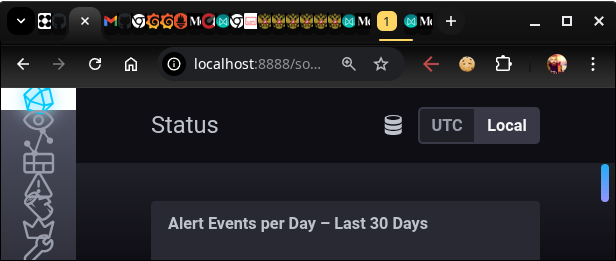

## Задание 8: Отображение метрик утилизации cpu из веб-интерфейса `telegraf`:

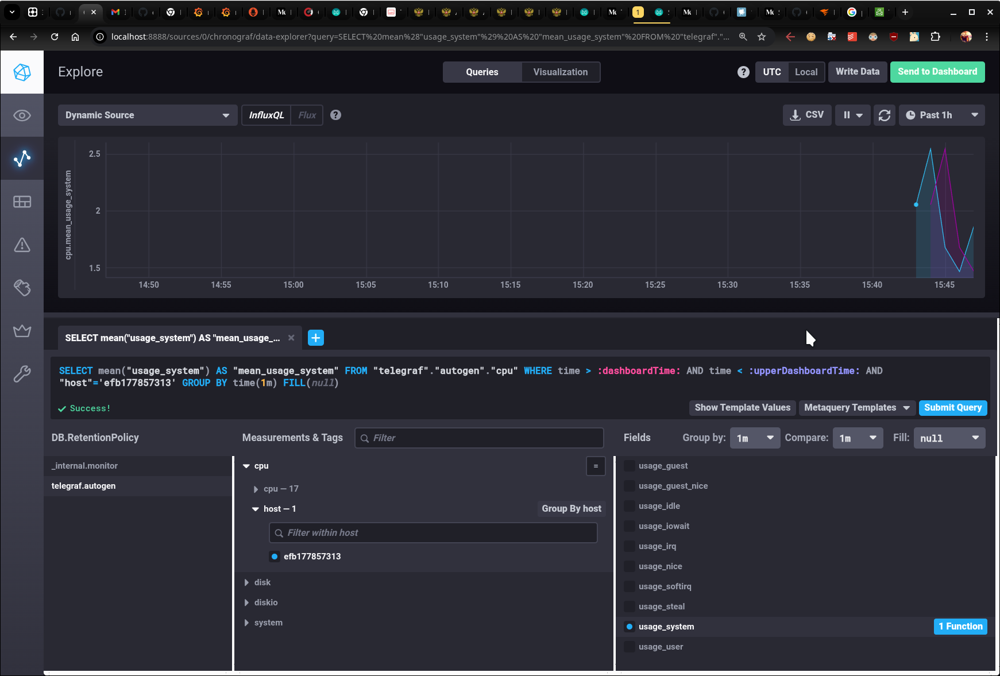

## Задание 8: Отображение метрик из веб-интерфейса `telegraf`, связанных с docker:

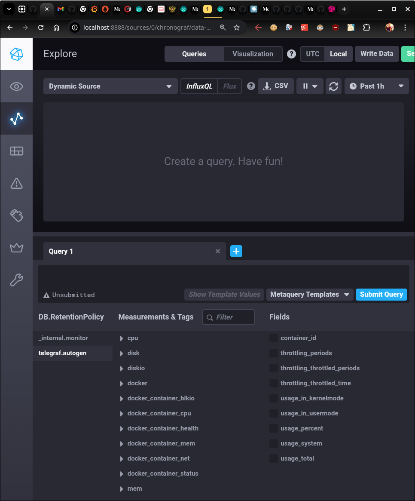


## Дополнительное задание

`а)` [monitoring_final.py](./Monitoring_systems/awesome_monitoring/monitoring_final.py)

`б)` конфигурация cron-расписания

`(sudo crontab -l 2>/dev/null; echo "* * * * * /usr/bin/python3 /home/a/PY/monitoring_final.py") | sudo crontab -`

`в)` [26-04-14-awesome-monitoring.log](./Monitoring_systems/awesome_monitoring/26-04-14-awesome-monitoring.log)


</details>

<details>
<summary>3. Система сбора логов Elastic Stack</summary>

## Задание 1

скриншот `docker ps` через `5 минут` после старта всех контейнеров (их должно быть 5):

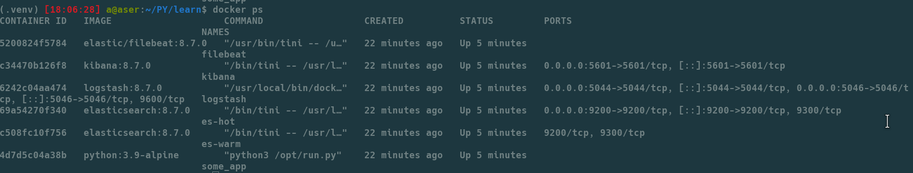

скриншот интерфейса `kibana`:


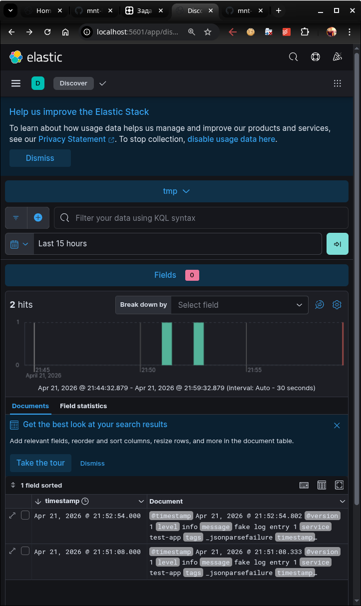


## Задание 2


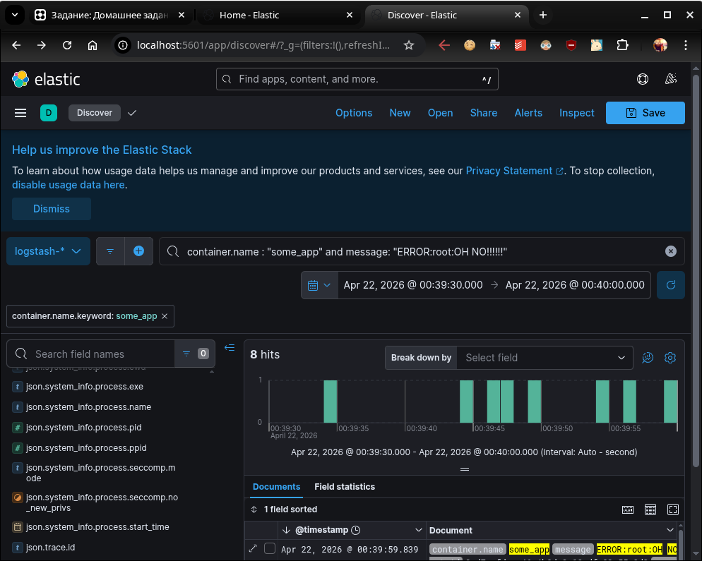


</details>
</details>

<details>
<summary>4. Платформа мониторинга Sentry</summary>

## Задание 1


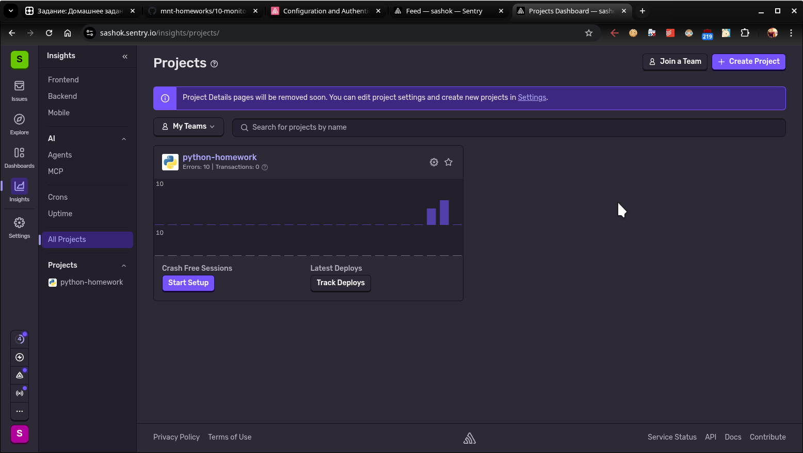

## Задание 2

[sample_sentry_script](Sentry/py_sentry/sentry_homework.py)

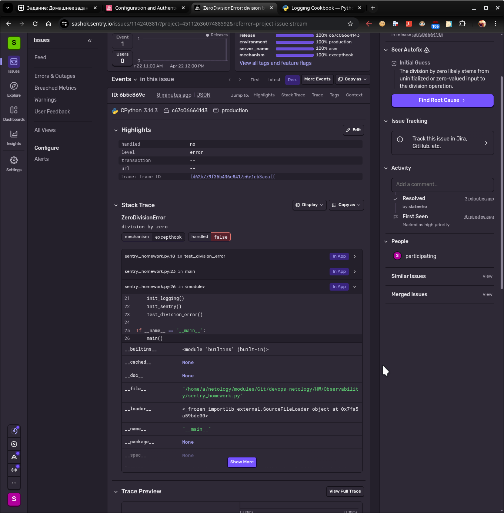

## Задание 3


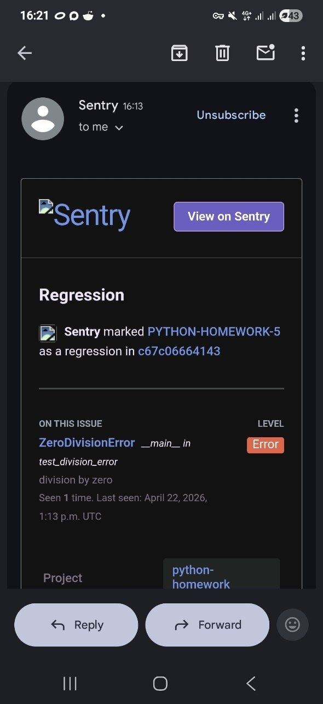

## Задание повышенной сложности


[awesome_monitoring_sentry_script](Sentry/py_sentry/sentry_monitoring.py)
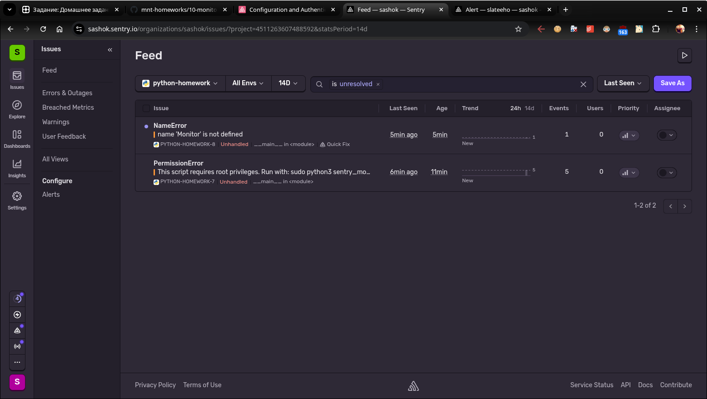

</details>

<details>
<summary>5. Postmortem</summary>


## Часть 1. Затронутые проекты или клиенты
GitHub Pages, Webhooks, операции записи метаданных (наприер, пуши), внутренние сервисы GitHub, внешние интеграции (приложения), CI\CD Jobs

### Точная временная шкала инцидента


#### Когда он начался?

`21.10.18 22:52`
 Короткий сбой связи между US E.Coast и US W.Coast в результате замены 100G оптоволоконного кабеля. На 45 секунд датацентры E.Coast – W.Coast без связи.
 Оркестратор выбирает нового primary на W.Coast, в результате чего откат к нормальной топологии (E.Coast как primary) невозможен: два датацентра содержат несовпадающие записи.

#### Когда был замечен?

`22:43`
 Запрос по API к Оркестратору показывает отсутствие корректной топологии репликации, кроме US W.Coast. Это критическое нарушение.

#### Кто заметил и как это выглядело?

 Замечены аномалии в топологии MySQL‑кластеров и резкое расхождение данных между регионами.
 Первые внешние симптомы — задержки push‑операций, нестабильность Github Pages, частичная недоступность API.

#### Задержка между обнаружением и началом работ

Между 22:52 и 23:07 — около 15 минут до перехода статуса в «желтый», затем в «красный».

#### Какие действия были выполнены?

`23:13`
 Порядка 40 минут записей от приложений мешают сделать E.Coast в качестве primary. Несколько секунд записей на E.Coast отсутствуют на W.Coast.
 Принято решение принести в жертву доступность и сохранить целостность данных.

`23:19`
 Остановка записи метаданных (push‑операции).

`00:05`
 Неподготовленный персонал - отсутствие практики полного восстановления кластера из бэкапа на новый сервер. Обычно использовалась репликация с задержкой.
 Начато восстановление из многотерабайтных четырехчасовых бэкапов.

`00:41`
 Инженеры ищут способы ускорить передачу бэкапов.

`06:51`
 Спустя почти 6 часов восстановление U.East завершено. Началась «здоровая» репликация данных от US.West.

`22.10.18 07:46`
 Публикация первого технического апдейта. Pages‑билды были остановлены ранее, публикация заняла больше времени.

`22.10.18 11:12`
 Все primaries снова на US E.Coast. Производительность улучшилась, но десятки read‑реплик отстают на часы и пользователи видят несогласованные данные.

`22.10.18 13:15`
 Пиковая нагрузка. Задержки репликации растут. Цикличность. Начато развертывание дополнительных read‑реплик в облаке US E.Coast.

`22.10.18 16:24`
 После синхронизации выполнен фейловер к исходной топологии. Статус остаётся красным — нужно обработать огромный бэклог.

`22.10.18 16:45`
 Начата обработка бэклога: 5+ млн webhook‑событий и 80 000 Pages‑билдов.
 ~200 000 webhook‑payloads отброшены из‑за истечения TTL.

`22.10.18 23:03`
 Обработка завершена. Целостность данных подтверждена. Статус зелёный.

#### Когда проблема была устранена?


`22.10.18 23:03` UTC — полное восстановление всех сервисов.


## Часть 2. Детали


# Краткое описание того, что произошло
 
Короткий сетевой разрыв между US E.Coast и US W.Coast вызвал split‑brain в БД MySQL. 
Выбор W.Coast как primary = невозможность  безопасного отката. Сохранение целостности данных, жертвуем доступностью. Восстановление требует  полного восстановления из бэкапов и последующей синхронизации реплик. После этого — обработка огромного бэклога.

# Технические подробности

45‑секундный разрыв связи -  Orchestrator выбирает  W.Coast как primary.


Несогласованные записи между регионами -  невозможность автоматического failback.


Принудительная остановка записи метаданных.


Полное восстановление из многотерабайтных бэкапов U.East.


Репликация от W.Coast  E.Coast после восстановления.


Отставание десятков read‑реплик на часы.


Cкорость догоняющей репликации следует нестандартному графику снижения мощности вместо линейной зависимости.


Пиковая нагрузка Европы/США замедляет восстановление.


Развёртывание дополнительных read‑реплик в облаке.


Обработка бэклога: 5 млн webhooks, 80k Pages builds.


Дроп 200k вебхуков по истечении TTL.

# Прямой денежный импакт

Потерь не зафиксировано, технический сбой официально не привел к убыткам. Кроме того, к тому моменту  Github уже фактически является дочерней компанией Microsoft.

# Предполагаемый денежный импакт

Дата инцидента GitHub: `21–22 октября 2018`
Дата официального закрытия сделки Microsoft–GitHub: `26 октября 2018` 

`Разница: ~4 дня до закрытия сделки` (сделка до публичного заявления о присоединении)


Возможная негативная оценка на будущее у инвесторов в краткосрочную перспективу.


Косвенный и репутационный импакт


Массовое обсуждение инцидента в соцсетях.


Недовольство корпоративных клиентов.


Снижение доверия к отказоустойчивости GitHub.


Переход незначительного количества разработчиков в GitLab по причине нетерпимости к Microsoft.

## Часть 3. А что же делать?

# Могли ли мы заметить и исправить проблему раньше? Могли. 

Проблемы:

Недостаточный мониторинг split‑brain инцидентов.
Отсутствие практики полного восстановления из бэкапов.
Недостаточная автоматизация проверки согласованности бекапа данных.

# Что нужно для этого?

Жёсткие правила leader‑election только внутри региона.
Регулярные DR‑учения с восстановлением из бэкапов.
Метрики согласованности реплик.

# Меры по предотвращению повторения и уроки


Настройка Оркестратора: запрет выбора primary в другом краю страны.


Новый механизм статуса с детализацией по сервисам.


Улучшение внутренних процедур публикации статуса при частичной недоступности.


Пересмотр TTL‑политик.


Усиление культуры проверки предположений и документирования исторических решений.


Установление других цветных статусов, кроме трех используемых.


