# Виртуализация и контейнеризация

<details>
<summary>1. Введение в виртуализацию</summary>

## Задача 2

| Задача | Рекомендуемая платформа | Критерии выбора |
|--------|-------------------------|------------------|
| Высоконагруженная база данных MySQL, критичная к отказу | Физические серверы | Максимальная производительность I/O, отсутствие задержек виртуализации, прямой доступ к железу, возможности RAID |
| Различные web-приложения | Виртуализация уровня ОС (контейнеры) | Быстрое масштабирование, изоляция приложений, эффективное использование ресурсов, микросервисная архитектура |
| Windows-системы для бухгалтерского отдела | Паравиртуализация | Совместимость с 1С и т.п. платформами, централизованное управление, снапшоты для бэкапов, изоляция пользователей |
| Системы высокопроизводительных расчётов на GPU | Физические серверы | Прямой доступ к GPU, отсутствие overhead, максимальная производительность CUDA/OpenCL, контроль над драйверами и библиотеками |

## Задание 3

| Сценарий | Рекомендуемое решение | Обоснование | Альтернатива |
|----------|----------------------|-------------|--------------|
| 100 виртуальных машин на базе Linux и Windows, общие задачи, нет особых требований. Преимущественно Windows based-инфраструктура, требуется реализация программных балансировщиков нагрузки, репликации данных и автоматизированного механизма создания резервных копий. | Microsoft Hyper-V | Интеграция с AD, PowerShell, поддержка репликации, резервного копирования, масштабируемость | Proxmox VE |
| Требуется наиболее производительное бесплатное open source-решение для виртуализации небольшой (20-30 серверов) инфраструктуры на базе Linux и Windows виртуальных машин. | Proxmox VE (KVM + LXC) | Поддержка Windows и Linux, веб-интерфейс, кластеры, live migration, резервное копирование | oVirt |
| Необходимо бесплатное, максимально совместимое и производительное решение для виртуализации Windows-инфраструктуры. | Microsoft Hyper-V | Максимальная совместимость с Windows, высокая производительность, встроен в Windows Server | KVM с VirtIO-драйверами |
| Необходимо рабочее окружение для тестирования программного продукта на нескольких дистрибутивах Linux. | Docker/Docker Swarm | Легковесные контейнеры для CLI, VirtualBox для GUI, кроссплатформенность, простота настройки. Для окружений до 10 машин Kubernetes будет ресурсоемким решением. | Vagrant + VirtualBox/Libvirt. Возможен k8s.|

## Задача 4

Опишите возможные проблемы и недостатки гетерогенной среды виртуализации (использования нескольких систем управления виртуализацией одновременно) и что необходимо сделать для минимизации этих рисков и проблем. Если бы у вас был выбор, создавали бы вы гетерогенную среду или нет?

1) Проблемы гетерогенной среды виртуализации.

а) Гетерогенная среда виртуализации как NP-полная задача.

Практическая реализация гетерогенной среды виртуализации представляет собой NP-полную задачу, аналогичную по сложности «задаче рюкзака». Она требует конечного объёма ресурсов, в рамках которых необходимо «упаковать» различные системы виртуализации на хостах разных типов. Цель — достичь максимального «объёма» (т.е. количества критически необходимых разнородных систем виртуализации) при максимальной ценности элементов (например, хостов, которые по техническим или регуляторным причинам не могут быть переведены на другой тип виртуализации). Пример: миграция с Hyper-V на Proxmox при условии, что одна из систем поддерживает только Hyper-V, а другая — нет, при этом необходимо сохранить QoS, например, для отделения частной хирургии.

б) Гетерогенная среда виртуализации как NP-трудная задача.

 Сложность задачи возрастает до NP-трудной, если учитывать постоянное добавление новых элементов в инфраструктуру (роботы, дроны, IoTT, Kubernetes + OpenStack, контейнеры Astra Linux и др.), что экспоненциально увеличивает количество возможных конфигураций и решений. Дополнительную NP-сложность вносит необходимость тестирования различных гетерогенных конфигураций.
 Для таких задач целесообразным представляется применение парного тестирования.

2) Общие подходы к минимизации рисков.

• Географически распределённая (относительно пользователей) сеть мелких или средних хостов на промежуточном (middleware) уровне cloud-IoT (как пример), тем самым реализуя идею гетерогенного пула при относительной гомогенности вычислительных ресурсов (CPU, RAM, GPU) с учётом нахождения реального баланса между QoS и SLA.

• Использование atomic hosts либо официальных immutable Docker-образов, появившихся недавно.

• Использование, например, BGP, поддержание мониторинга аномалий AS_PATH и метрик QoS/SLA.

• Понимание выбора стратегии (балансировка QoS/SLA, Latency Greedy, Cost Greedy, GeKube).

• Использование адаптирующихся эволюционных алгоритмов. Для решения задач предсказания поведения гетерогенной виртуализации необходимо применять различные математические модели. Так, для линейных показателей (например, соотношение CPU/Memory, IOPS к утилизации диска и т.п.) целесообразно использовать фундаментальные методы тестирования, такие как Granger causality. В то же время, для нелинейных метрик — CPU, GPU, Memory — характерно поведение, требующее предварительного усреднения или расчёта средневзвешенных значений; в таких случаях эффективно применяются модели ARIMA или SARIMA.

• Политика, где миграция контейнера на ближайший узел будет приоритетнее его вертикального масштабирования, а одна нода не получит ресурсов больше самой ресурсоемкой.

3) Примеры репозиториев с гетерогенной средой оркестрации Kubernetes в GitHub.

- eddytruyen/heterogenous-scaling-in-k8s - включение/отключение гетерогенного масштабирования, инструменты симуляции нагрузок, создание YAML-матриц масштабирования в зависимости от присвоенного класса (Золото, Бронза), контроллер масштабирования со своим неймспейсом и подом resource-planner. Graphite для метрик (push-based). Heapster, Grafana - визуализация.

- lippertmarkus/vagrant-k8s-win-hostprocess - построенный на базе Vagrant кластер под управлением нодами типа winworker с помощью Windows HostProcess Pods, с одной стороны, и с другой - Calico/CNI для классической оркестрации линукс нод, при этом не используется установка новых Windows сервисов.

- hufs-ese-lab/MC-Kube (автономное вождение, индустриальный IoT), мониторинг на уровне eBPF c уменьшением отклика в 246 раз по сравнению со стандартными API запросами k8s, инструменты для патчинга стандартного Completely Fair (CFS) шедулера (установка SCHED_DEADLINE для подов через патчи), автоматизация рантайма (задача, которая не выполнена в дедлайн попадает в runtime_hi).

4) Проблемы выбора гетерогенной среды.

В ближайшие 20 лет, с учётом развития квантовых вычислений, нейроморфных чипов, интернета вещей (IoT) и роботизации, гетерогенная инфраструктура станет единственно возможной.
</details>
<details>
<summary>2. Применение принципов IaaC в работе с виртуальными машинами</summary>

## Задача 2

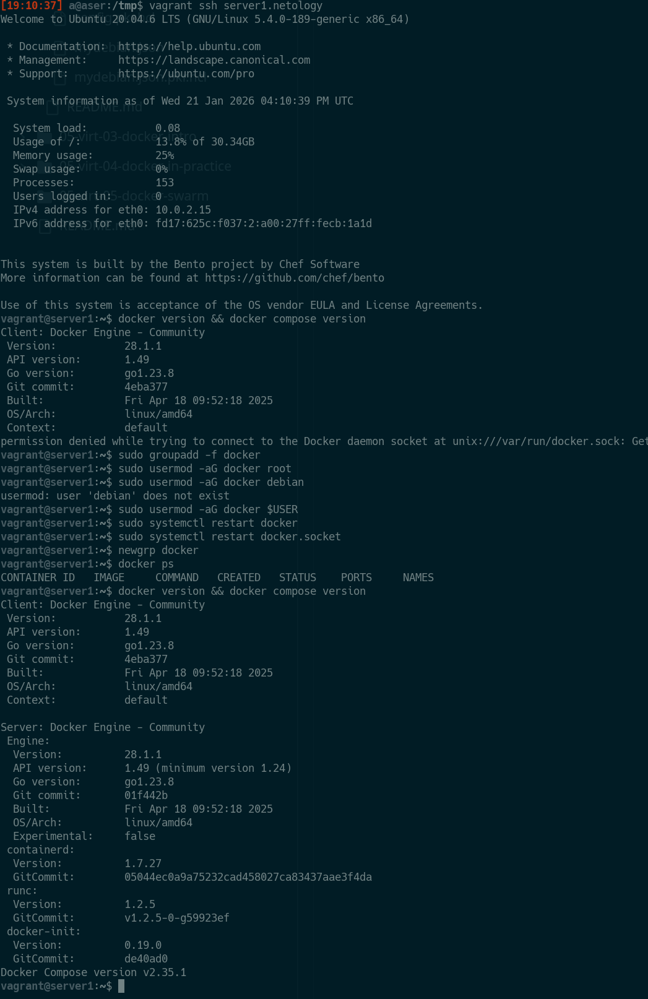

## Задача 3


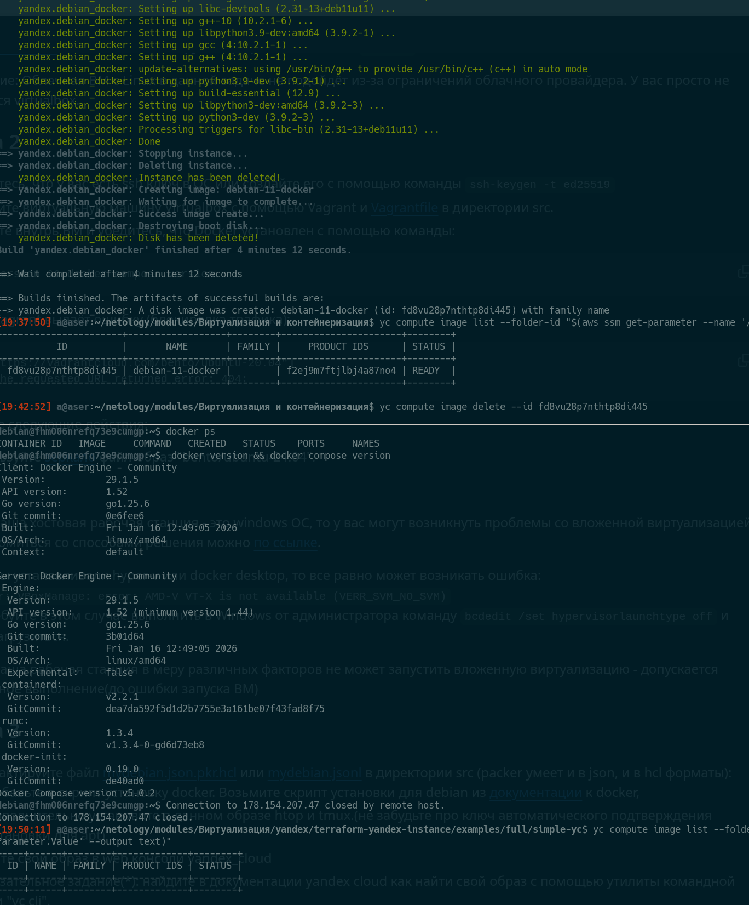

</details>

<details>
<summary>4. Оркестрация группой Docker контейнеров на примере Docker Compose</summary>


## Задача 1

[Ссылка на Репозиторий: slateecho/custom-nginx](https://hub.docker.com/repository/docker/slateecho/custom-nginx/general)

## Задача 2

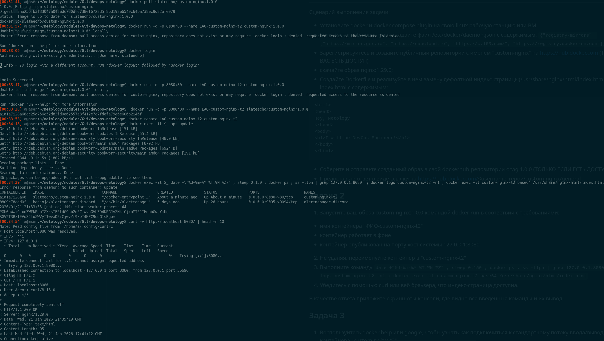

## Задача 3

Поскольку при выполнении docker attach опция --sig-proxy[=true] по умолчанию включена, происходит переадресация всех сигналов из терминала к PID 1 внутри контейнера, как если бы он был запущен в терминале. Процесс может быть настроен определённым образом отвечать на SIGINT (^C), например, игнорируя его.

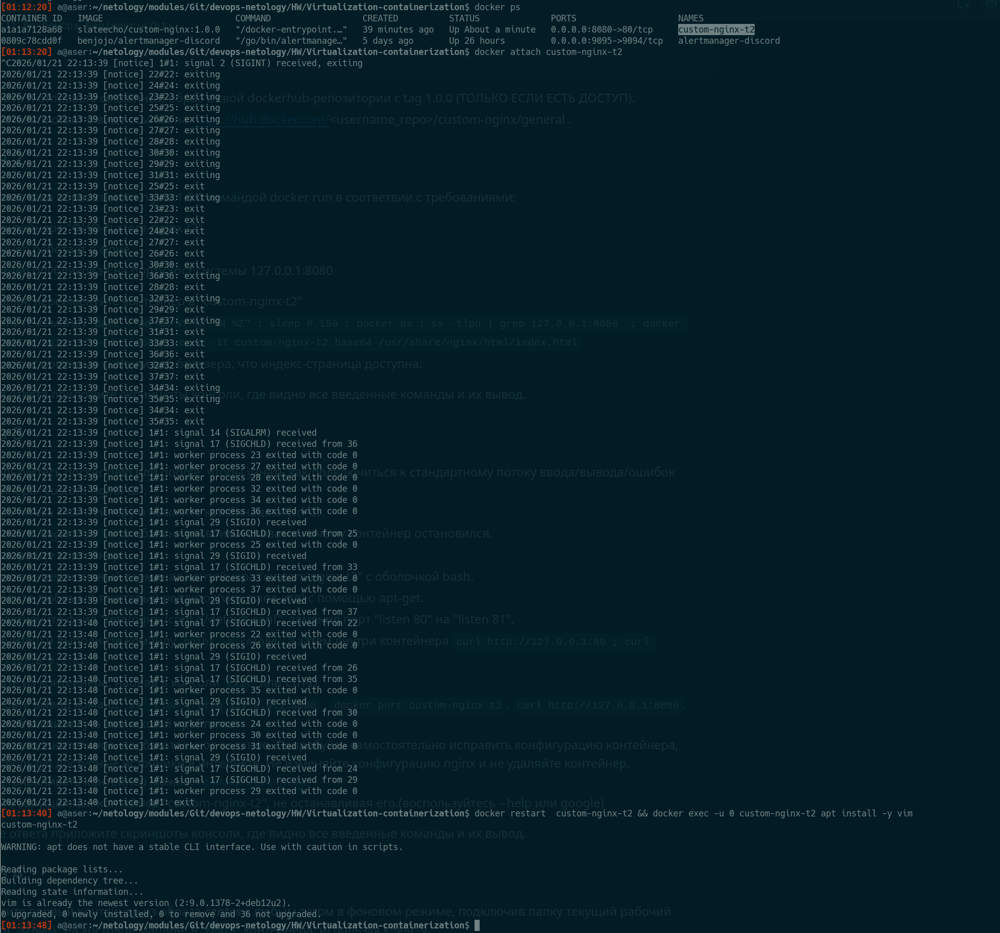

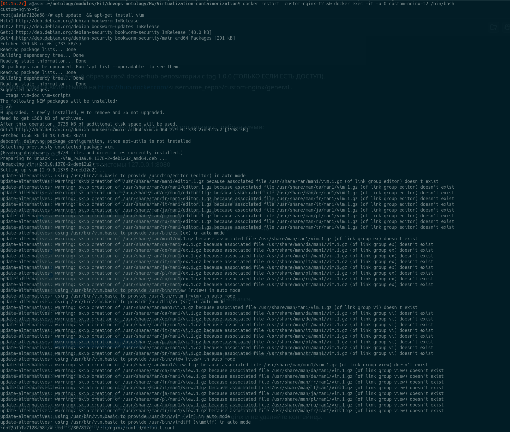

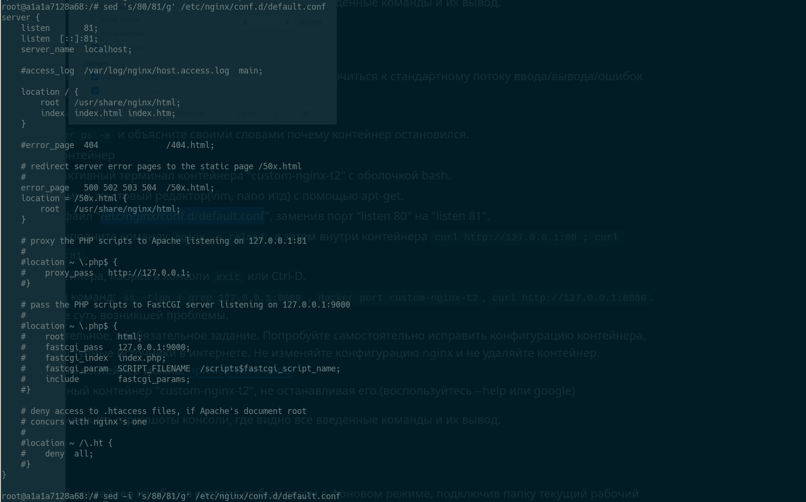

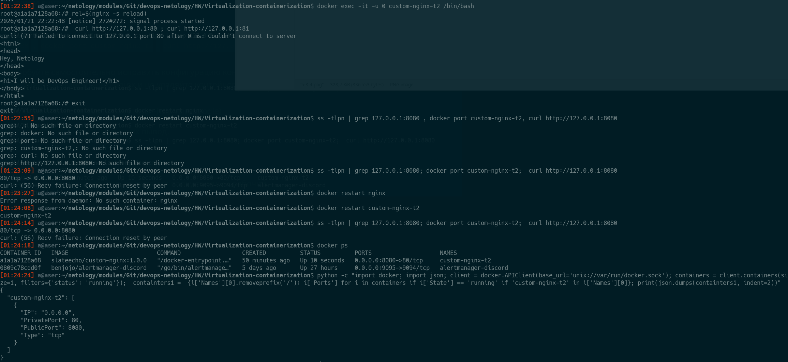

Поскольку маппинг портов, как отображено на скриншоте выше, при изменении внутри контейнера параметров запуска не меняется, а в логах появляется запись "10-listen-on-ipv6-by-default.sh: info: /etc/nginx/conf.d/default.conf differs from the packaged version", не представляется возможным изменить параметры Nginx контейнера путём редактирования его conf файла внутри контейнера.

*На основе упомянутого https://www.baeldung.com/ops/assign-port-docker-container мануала изменён внутренний порт с 80 на 81.

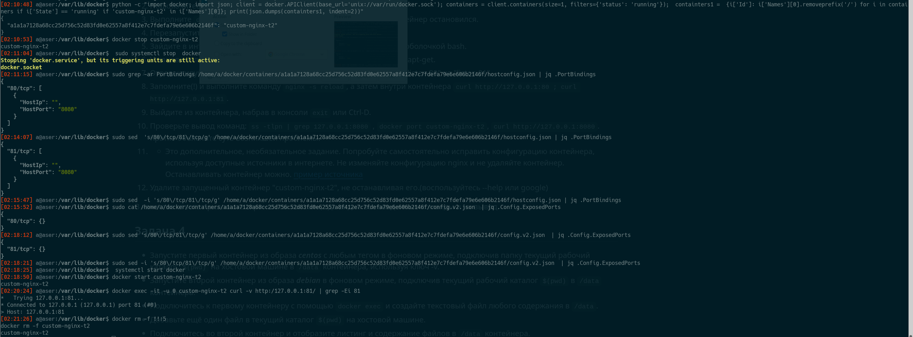

## Задача 3

1) Был запущен файл compose.yaml (с сервисом portainer), поскольку, как указано в документации по адресу https://docs.docker.com/compose/intro/compose-application-model/, это предпочтительное название по умолчанию для запуска Docker Compose.

2) Скриншот второго контейнера nginx.

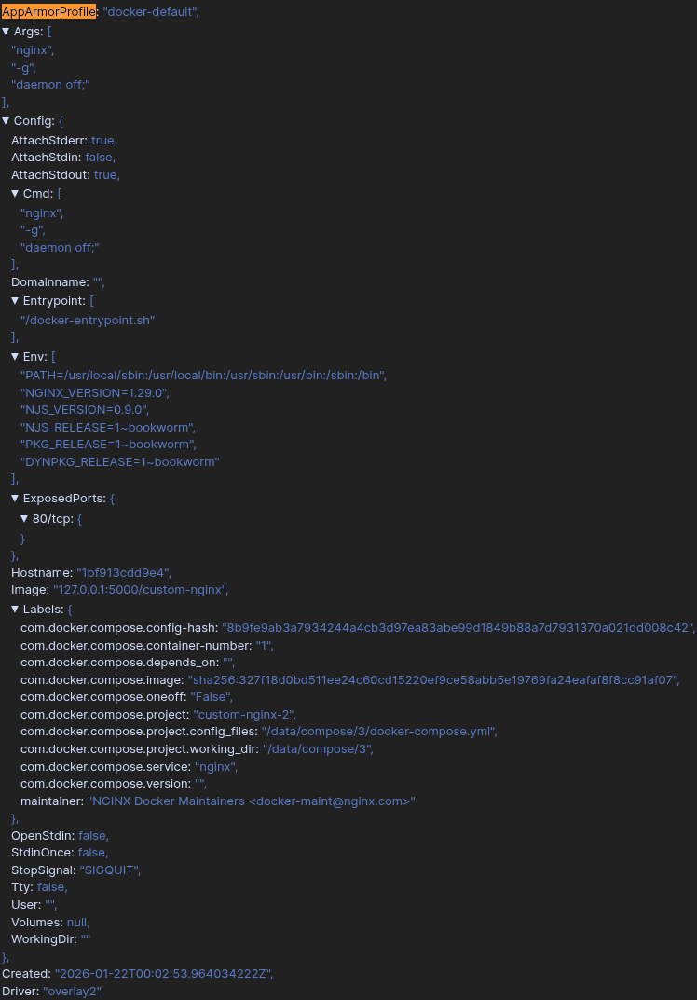

3) После удаления compose.yaml остался "сиротский" контейнер Portainer, который было предложено удалить в предупреждении.

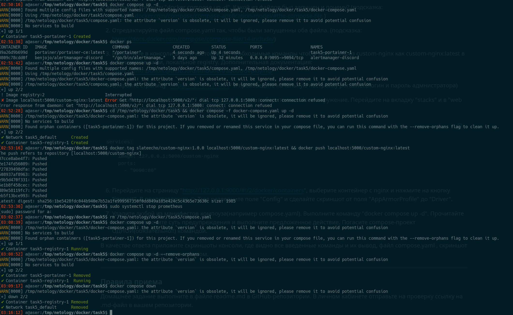

</details>

<details>
<summary>5. Практическое применение Docker</summary>


## **Задача 0**
Выполнена подготовка рабочей среды: проверено отсутствие устаревшего `docker-compose` (V1) и установлена актуальная версия Docker Compose Plugin (V2) как часть Docker Engine. Установка проведена через официальный репозиторий Docker для корректной работы команд с пробелом (`docker compose`).

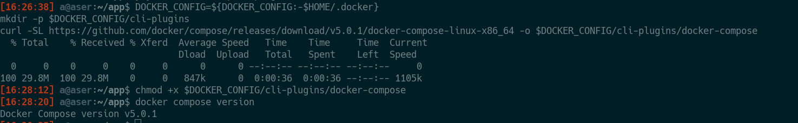

## **Задача 1**
Создан форк исходного репозитория для безопасной разработки. Внесены требуемые изменения: разработан `Dockerfile.python` на основе `python:3.12-slim`, созданы файлы `.dockerignore` и `.gitignore`. Сборка и запуск веб-приложения на FastAPI с помощью `uvicorn` протестированы локально.

Тест корректности сборки:

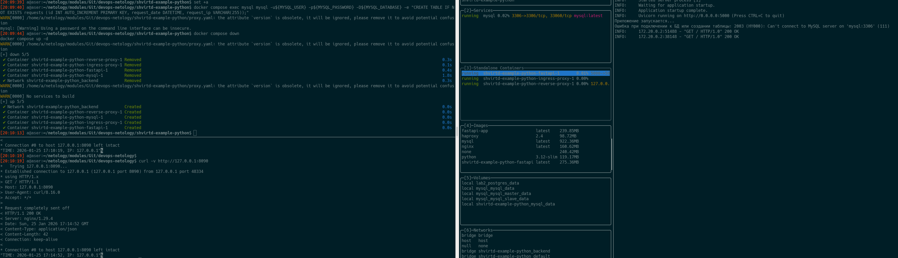

Запуск через docker-compose c указанием на Dockerfile.python:


**Запущен main.py через python3-venv:

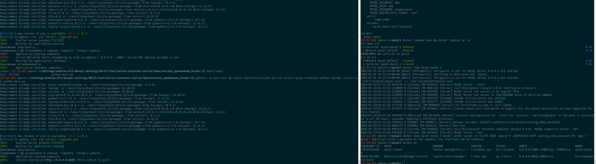
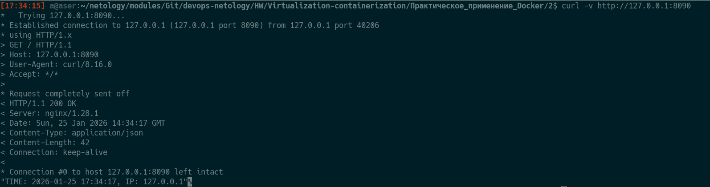

***Необязательная часть

Код приложения для управления названием таблицы через ENV переменную:

```python
from datetime import datetime
import os
import time
from contextlib import contextmanager, asynccontextmanager

import mysql.connector
from fastapi import FastAPI, Request, Depends, Header
from typing import Optional


# --- 1. Конфигурация ---
# Считываем конфигурацию БД из переменных окружения
db_host = os.environ.get('DB_HOST')
db_user = os.environ.get('MYSQL_USER')
db_password = os.environ.get('MYSQL_PASSWORD')
db_name = os.environ.get('MYSQL_DATABASE')
db_table = os.environ.get('MYSQL_TABLE')
db_auth_plugin = 'caching_sha2_password'

@asynccontextmanager
async def lifespan(app: FastAPI):
    # Код, который выполнится перед запуском приложения
    print("Приложение запускается...")
    try:
        # Retry loop to wait for MySQL
        db = None
        for attempt in range(10):
            try:
                db = mysql.connector.connect(
                    host=db_host,
                    user='root',
                    password=os.environ.get('MYSQL_ROOT_PASSWORD')
                )
                break
            except mysql.connector.Error as err:
                print(f"MySQL not ready yet (attempt {attempt + 1}/10): {err}")
                time.sleep(3)
        else:
            print("MySQL did not become ready in time.")
            yield
            return

        cursor = db.cursor()
        # Create database if not exists
        cursor.execute(f"CREATE DATABASE IF NOT EXISTS `{db_name}`")
        db.commit()
        cursor.close()
        db.close()

        # Connect to database
        db = mysql.connector.connect(
            host=db_host,
            user='root',
            password=os.environ.get('MYSQL_ROOT_PASSWORD'),
            database=db_name
        )
        cursor = db.cursor()
        create_user_query = f"""
        CREATE USER IF NOT EXISTS '{db_user}'@'%' IDENTIFIED WITH {db_auth_plugin} BY '{db_password}';
        GRANT ALL PRIVILEGES ON `{db_name}`.* TO '{db_user}'@'%';
        FLUSH PRIVILEGES;
        """
        cursor.execute(create_user_query)
        db.commit()
        # Create table
        create_table_query = f"""
        CREATE TABLE IF NOT EXISTS `{db_table}` (
            id INT AUTO_INCREMENT PRIMARY KEY,
            request_date DATETIME,
            request_ip VARCHAR(255)
        )
        """
        cursor.execute(create_table_query)
        db.commit()
        print(f"Соединение с БД установлено и таблица \'{db_table}\' готова к работе.")
        cursor.close()
        db.close()
    except mysql.connector.Error as err:
        print(f"Ошибка при подключении к БД или создании таблицы: {err}")

    yield

    # Код, который выполнится при остановке приложения
    print("Приложение останавливается.")


# Создаем экземпляр FastAPI с использованием lifespan
app = FastAPI(
    title="Shvirtd Example FastAPI",
    description="Учебный проект, FastAPI+Docker.",
    version="1.0.0",
    lifespan=lifespan
)


# --- 2. Управление соединением с БД ---
@contextmanager
def get_db_connection():
    db = None
    try:
        db = mysql.connector.connect(
            host=db_host,
            user=db_user,
            password=db_password,
            database=db_name
        )
        yield db
    finally:
        if db is not None and db.is_connected():
            db.close()


# --- 3. Зависимость для получения IP ---
def get_client_ip(x_real_ip: Optional[str] = Header(None)):
    return x_real_ip


# --- 5. Основной эндпоинт ---
@app.get("/")
def index(request: Request, ip_address: Optional[str] = Depends(get_client_ip)):
    final_ip = ip_address  # Только из X-Forwarded-For, без fallback

    now = datetime.now()
    current_time = now.strftime("%Y-%m-%d %H:%M:%S")

    try:
        with get_db_connection() as db:
            cursor = db.cursor()
            query = f"INSERT INTO `{db_table}` (request_date, request_ip) VALUES (%s, %s)"
            values = (current_time, final_ip)
            cursor.execute(query, values)
            db.commit()
            cursor.close()
    except mysql.connector.Error as err:
        return {"error": f"Ошибка при работе с базой данных: {err}"}

    # Подсказка для студентов при неправильном обращении
    if final_ip is None:
        ip_display = "похоже, что вы направляете запрос в неверный порт(например curl http://127.0.0.1:5001). Правильное выполнение задания - отправить запрос в порт 8090."
    else:
        ip_display = final_ip

    return f'TIME: {current_time}, IP: {ip_display}'


# --- 5. Отладочный эндпоинт ---
@app.get("/debug")
def debug_headers(request: Request):
    """Показывает все заголовки для отладки откуда берется IP"""
    return {
        "headers": dict(request.headers),
        "client_host": request.client.host if request.client else None,
        "x_forwarded_for": request.headers.get('x-forwarded-for'),
        "real_ip": request.headers.get('x-real-ip'),
        "forwarded": request.headers.get('forwarded')
    }


# --- 6. Эндпоинт для просмотра записей в БД ---
@app.get("/requests")
def get_requests():
    """Возвращает все записи из таблицы для проверки"""
    try:
        with get_db_connection() as db:
            cursor = db.cursor()
            query = f"SELECT id, request_date, request_ip FROM `{db_table}` ORDER BY id DESC LIMIT 50"
            cursor.execute(query)
            records = cursor.fetchall()
            cursor.close()

            # Преобразуем записи в читабельный формат
            result = []
            for record in records:
                result.append({
                    "id": record[0],
                    "request_date": record[1].strftime("%Y-%m-%d %H:%M:%S") if record[1] else None,
                    "request_ip": record[2]
                })

            return {
                "total_records": len(result),
                "records": result
            }
    except mysql.connector.Error as err:
        return {"error": f"Ошибка при чтении из базы данных: {err}"}


# --- 7. Запуск приложения ---
# Для запуска этого файла используется ASGI-сервер, например, uvicorn.
# Команда: uvicorn main:app --reload
if __name__ == '__main__':
    import uvicorn
    uvicorn.run(app, host='0.0.0.0', port=5000)
```
## **Задача 2***
Настроен и аутентифицирован Yandex Container Registry для централизованного хранения образов. Собранный образ Python-приложения загружен в реестр. Проведено сканирование образа на уязвимости с формированием отчета о безопасности.


Отчет сканирования:
```json
[
  {
    "id": "chesg1i37iairok8226i",
    "image_id": "crp14i6nrb3urbqmiv60",
    "scanned_at": "2026-01-25T18:03:57.424Z",
    "status": "READY",
    "vulnerabilities": {
      "high": "2",
      "medium": "14",
      "low": "51"
    }
  }
]
```
## **Задача 3**
Разработан `compose.yaml` с использованием директивы `include` для подключения `proxy.yaml`. Конфигурация описывает два сервиса (`web` и `db`) в выделенной сети `backend` с фиксированными IP-адресами. Настроены политики перезапуска и переменные окружения для подключения к MySQL. Проверена корректная работа связки через curl-запросы и SQL-запросы к базе данных.


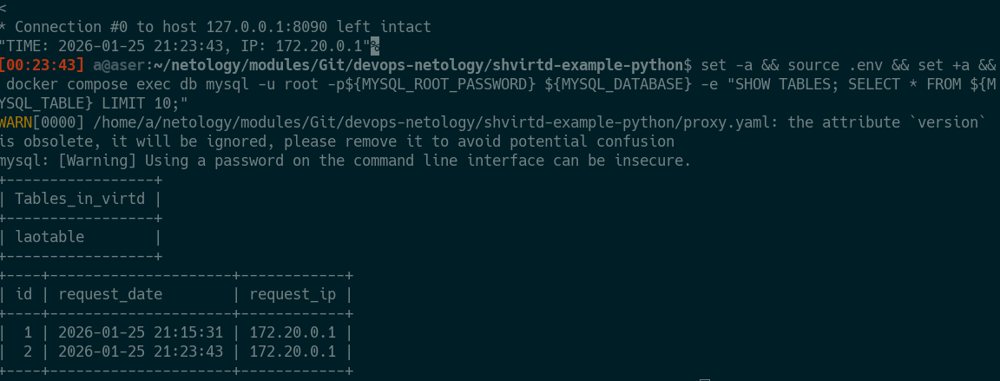

## **Задача 4**
Развернута виртуальная машина в Yandex Cloud с установленным Docker. Написан и запущен bash-скрипт для автоматического развертывания проекта из fork-репозитория. Проверена доступность сервиса извне через цепочку `Пользователь → Internet → Nginx → HAProxy → FastAPI → HAProxy → Nginx → Internet → Пользователь`. Настроен удаленный контекст SSH для управления Docker.


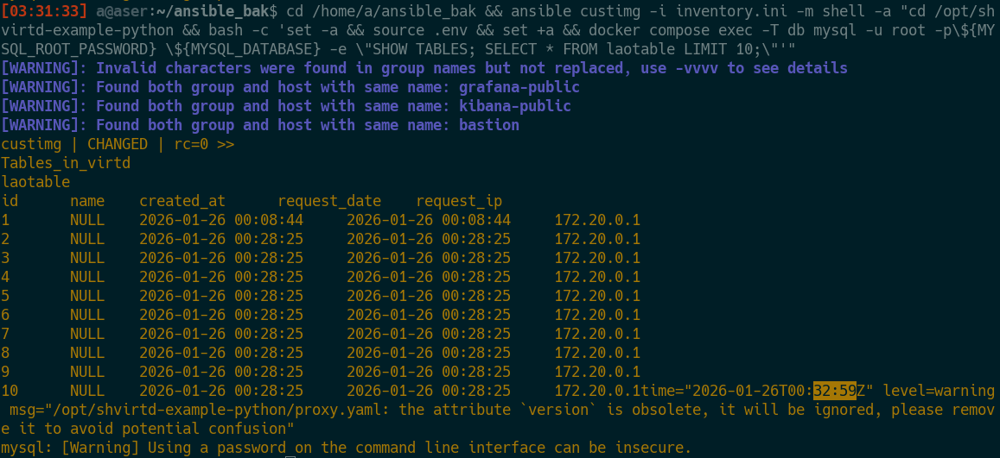

[Ссылка на форк](https://github.com/slateeho/devops-netology/tree/main/shvirtd-example-python)


## **Задача 5***
Реализована система резервного копирования БД MySQL с использованием контейнеризованного `schnitzler/mysqldump`. Разработан bash-скрипт для создания дампа базы данных. Настроено автоматическое выполнение резервных копий.

Скрипт:

```shell
#!/bin/bash
set -e

cd /opt/shvirtd-example-python
source .env

mkdir -p /opt/backup
sudo chmod 777 /opt/backup

now=$(date +"%s_%Y-%m-%d_%H-%M-%S")

docker compose exec -T db mysqldump --opt \
  --no-tablespaces \
  -u "${MYSQL_USER}" \
  -p"${MYSQL_PASSWORD}" \
  "${MYSQL_DATABASE}" \
  > "/opt/backup/${now}_${MYSQL_DATABASE}.sql"
```

cron-task:
```shell
echo '* * * * * /usr/local/bin/mysql-backup.sh >> /var/log/mysql-backup.log 2>&1' | crontab -
```

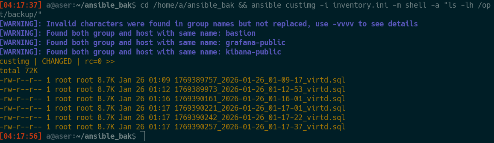

## **Задача 6**
Изучены различные методы извлечения файлов из Docker-образов. Выполнено копирование бинарного файла `/bin/terraform` из образа `hashicorp/terraform:latest` с использованием утилиты `dive` и команды `docker save`. Процесс извлечения дублирован с помощью команды `docker cp` для сравнения подходов.

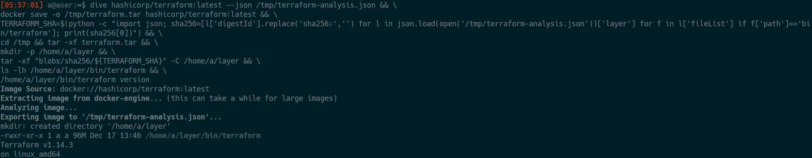

## **Задача 6.1**
Разработан альтернативный метод извлечения файла с использованием только команды `docker build` и кастомного Dockerfile. Реализована стратегия многоступенчатой сборки для получения требуемого исполняемого файла.

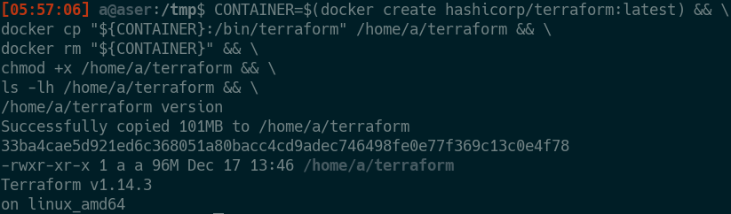

## **Задача 6.2 (**)** :
Разработан продвинутый метод извлечения файла из контейнера, используя только команду `docker build` и кастомный Dockerfile с многоступенчатой сборкой.

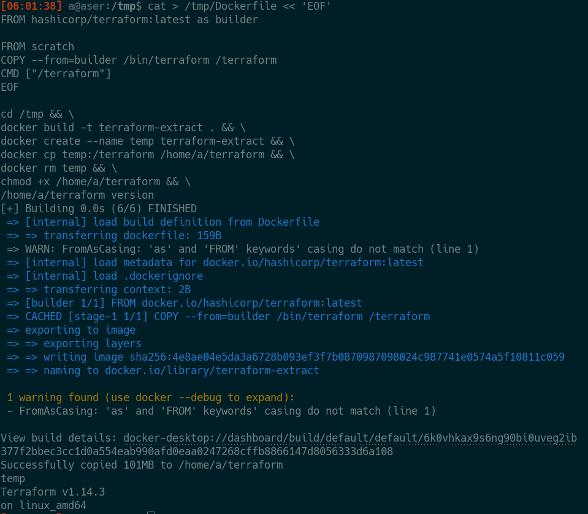

## **Задача 7 (***)**
Проведен запуск Python http сервера с помощью runC без использования Docker или containerd. Поднята alpine rootfs, на основе https://github.com/opencontainers/runtime-spec/blob/main/config.md  генерирован runc `config.json`, настроена инфрастурктура для работы сети в контейнере, приложены скриншоты работыи http сервера.
/home/a/backup-script.sh
1) https://github.com/alealexpro100/linux_install/blob/master/bin/alpine-bootstrap - создание rootfs c установкой python3.

2)

вариант a) `config.json` root контейнер c лимитами\Control Group v2:

```json
{
  "ociVersion": "1.3.0",
  "process": {
    "terminal": true,
    "user": {
      "uid": 0,
      "gid": 0
    },
    "args": [
      "python3",
      "/server.py"
    ],
    "env": [
      "PATH=/usr/local/sbin:/usr/local/bin:/usr/sbin:/usr/bin:/sbin:/bin",
      "TERM=xterm"
    ],
    "cwd": "/",
    "capabilities": {
      "bounding": [
        "CAP_AUDIT_WRITE",
        "CAP_KILL",
        "CAP_NET_BIND_SERVICE"
      ],
      "effective": [
        "CAP_AUDIT_WRITE",
        "CAP_KILL",
        "CAP_NET_BIND_SERVICE"
      ],
      "permitted": [
        "CAP_AUDIT_WRITE",
        "CAP_KILL",
        "CAP_NET_BIND_SERVICE"
      ]
    },
    "rlimits": [
      {
        "type": "RLIMIT_NOFILE",
        "hard": 1024,
        "soft": 1024
      }
    ],
    "noNewPrivileges": true
  },
  "id": "http-py-app",
  "bundle": "/app",
  "root": {
    "path": "rootfs",
    "readonly": false
  },
  "hostname": "alpine-http",
  "mounts": [
    {
      "destination": "/proc",
      "type": "proc",
      "source": "proc"
    },
    {
      "destination": "/dev",
      "type": "tmpfs",
      "source": "tmpfs",
      "options": [
        "nosuid",
        "strictatime",
        "mode=755",
        "size=65536k"
      ]
    },
    {
      "destination": "/dev/pts",
      "type": "devpts",
      "source": "devpts",
      "options": [
        "nosuid",
        "noexec",
        "newinstance",
        "ptmxmode=0666",
        "mode=0620",
        "gid=5"
      ]
    }
  ],
  "linux": {
    "cgroupsPath": "http-py-app",
    "resources": {
      "memory": {
        "limit": 268435456,
        "swap": 0,
        "disableOOMKiller": false
      },
      "cpu": {
        "cpus": "0",
        "shares": 512,
        "quota": 5000,
        "period": 100000
      },
      "pids": {
        "limit": 256
      },
      "devices": [
        {
          "allow": true,
          "access": "rwm"
        }
      ]
    },
    "unified": {
      "io.max": "259:0 rbps=1048576 wiops=10\n253:0 rbps=1048576 wiops=10"
    },
    "memoryPolicy": {
      "mode": "MPOL_LOCAL"
    },
    "seccomp": {
      "defaultAction": "SCMP_ACT_ALLOW",
      "architectures": [
        "SCMP_ARCH_X86",
        "SCMP_ARCH_X32"
      ],
      "syscalls": [
        {
          "names": ["ptrace", "mount", "umount2", "kexec_load", "open_by_handle_at"],
          "action": "SCMP_ACT_ERRNO"
        }
      ]
    },
    "maskedPaths": ["/proc/acpi", "/proc/kcore", "/proc/kmem", "/proc/kmsg", "/proc/mem", "/proc/sysrq-trigger"],
    "namespaces": [
      {
        "type": "pid"
      },
      {
        "type": "network",
        "path": "/var/run/netns/alpine_network"
      },
      {
        "type": "ipc"
      },
      {
        "type": "uts"
      },
      {
        "type": "mount"
      },
      {
        "type": "cgroup"
      },
      {
        "type": "user"
      }
    ],
    "uidMappings": [
      {
        "containerID": 0,
        "hostID": 0,
        "size": 65536
      }
    ],
    "gidMappings": [
      {
        "containerID": 0,
        "hostID": 0,
        "size": 65536
      }
    ]
  },
  "annotations": {
    "app": "http-server"
  }
}
```

б) вариант rootless контейнера с лимитом CPU\Mem:

```json
{
	"ociVersion": "1.3.0",
	"process": {
		"terminal": false,
		"user": {
			"uid": 0,
			"gid": 0
		},
		"args": [
			"python3",
			"/server.py"
		],
		"env": [
			"PATH=/usr/local/sbin:/usr/local/bin:/usr/sbin:/usr/bin:/sbin:/bin",
			"TERM=xterm"
		],
		"cwd": "/",
		"capabilities": {
			"bounding": [
				"CAP_AUDIT_WRITE",
				"CAP_KILL",
				"CAP_NET_BIND_SERVICE",
				"CAP_SYS_ADMIN",
				"CAP_NET_ADMIN"
			],
			"effective": [
				"CAP_AUDIT_WRITE",
				"CAP_KILL",
				"CAP_NET_BIND_SERVICE",
				"CAP_SYS_ADMIN",
				"CAP_NET_ADMIN"
			],
			"permitted": [
				"CAP_AUDIT_WRITE",
				"CAP_KILL",
				"CAP_NET_BIND_SERVICE",
				"CAP_SYS_ADMIN",
				"CAP_NET_ADMIN"
			]
		},
		"rlimits": [
			{
				"type": "RLIMIT_NOFILE",
				"hard": 1024,
				"soft": 1024
			}
		],
		"noNewPrivileges": true
	},
	"root": {
		"path": "rootfs",
		"readonly": false
	},
	"hostname": "runc",
	"mounts": [
		{
			"destination": "/proc",
			"type": "proc",
			"source": "proc"
		},
		{
			"destination": "/dev",
			"type": "tmpfs",
			"source": "tmpfs",
			"options": [
				"nosuid",
				"strictatime",
				"mode=755",
				"size=65536k"
			]
		},
		{
			"destination": "/dev/pts",
			"type": "devpts",
			"source": "devpts",
			"options": [
				"nosuid",
				"noexec",
				"newinstance",
				"ptmxmode=0666",
				"mode=0620"
			]
		},
		{
			"destination": "/dev/shm",
			"type": "tmpfs",
			"source": "shm",
			"options": [
				"nosuid",
				"noexec",
				"nodev",
				"mode=1777",
				"size=65536k"
			]
		},
		{
			"destination": "/dev/mqueue",
			"type": "mqueue",
			"source": "mqueue",
			"options": [
				"nosuid",
				"noexec",
				"nodev"
			]
		},
		{
			"destination": "/sys",
			"type": "none",
			"source": "/sys",
			"options": [
				"rbind",
				"nosuid",
				"noexec",
				"nodev",
				"ro"
			]
		},
		{
			"destination": "/sys/fs/cgroup",
			"type": "cgroup",
			"source": "cgroup",
			"options": [
				"nosuid",
				"noexec",
				"nodev",
				"relatime",
				"ro"
			]
		}
	],
	"linux": {
		"uidMappings": [
			{
				"containerID": 0,
				"hostID": 1000,
				"size": 1
			}
		],
		"gidMappings": [
			{
				"containerID": 0,
				"hostID": 1000,
				"size": 1
			}
		],
		"namespaces": [
			{
				"type": "pid"
			},
			{
				"type": "ipc"
			},
			{
				"type": "uts"
			},
			{
				"type": "mount"
			},
			{
				"type": "cgroup"
			},
			{
				"type": "user"
			}
		],
		"maskedPaths": [
			"/proc/acpi",
			"/proc/asound",
			"/proc/kcore",
			"/proc/keys",
			"/proc/latency_stats",
			"/proc/timer_list",
			"/proc/timer_stats",
			"/proc/sched_debug",
			"/sys/firmware",
			"/proc/scsi"
		],
		"readonlyPaths": [
			"/proc/bus",
			"/proc/fs",
			"/proc/irq",
			"/proc/sys",
			"/proc/sysrq-trigger"
		]
	}
}
```


3) Сеть:

```bash
#!/bin/bash


if [[ $EUID -ne 0 ]]; then
   echo "This script must be run as root"
   exit 1
fi

set -e

if ! command -v iptables &> /dev/null; then
   pacman -Sy --noconfirm iptables
fi

if ! command -v iptables-save &> /dev/null; then
   pacman -Sy --noconfirm iptables-nft
fi

pacman -Sy --noconfirm shadow dbus

sudo -u "#1000" yay -S libcgroup rootlesskit slirp4netns libcgroup libwrap --noconfirm


systemctl enable netfilter-persistent
systemctl start netfilter-persistent

NETNS="alpine_network"
VETH_HOST="veth-host"
VETH_ALPINE="veth-alpine"
IP_SUBNET="192.168.10.1/24"
IP_GATEWAY="192.168.10.1"

ip netns add $NETNS
ip link add name $VETH_HOST type veth peer name $VETH_ALPINE
ip link set $VETH_ALPINE netns $NETNS
ip netns exec $NETNS ip link set lo up
ip netns exec $NETNS ip addr add $IP_SUBNET dev $VETH_ALPINE
ip netns exec $NETNS ip link set $VETH_ALPINE up
ip link set $VETH_HOST up
ip route add $IP_GATEWAY/32 dev $VETH_HOST
ip netns exec $NETNS ip route add default via $IP_GATEWAY dev $VETH_ALPINE

sleep 2

iptables -P INPUT DROP
iptables -P FORWARD DROP
iptables -P OUTPUT ACCEPT

iptables -A INPUT -i lo -j ACCEPT
iptables -A INPUT -m state --state ESTABLISHED,RELATED -j ACCEPT
iptables -A INPUT -p tcp --dport 22 -j ACCEPT
iptables -A INPUT -p tcp --dport 80 -j ACCEPT
iptables -A INPUT -p tcp --dport 443 -j ACCEPT
iptables -A INPUT -p tcp --dport 8080 -j ACCEPT

iptables -A FORWARD -i $VETH_HOST -j ACCEPT
iptables -A FORWARD -o $VETH_HOST -j ACCEPT
iptables -t nat -A POSTROUTING -o eth0 -j MASQUERADE

iptables-save > /etc/iptables/iptables.rules
```
Вывод `tree -L2 /app`:<t_��>,ý:q""ýý

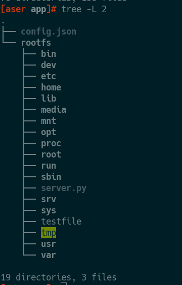

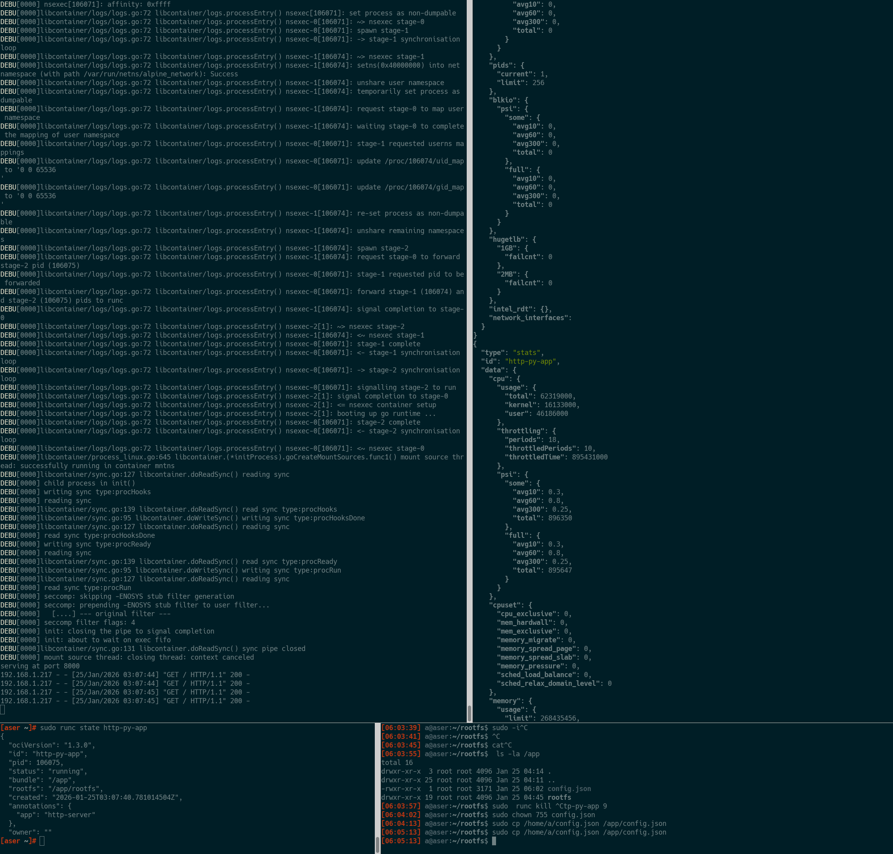

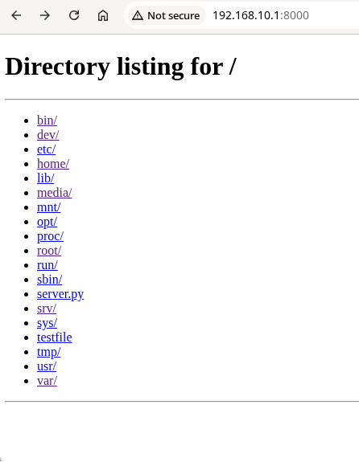

Rootless:

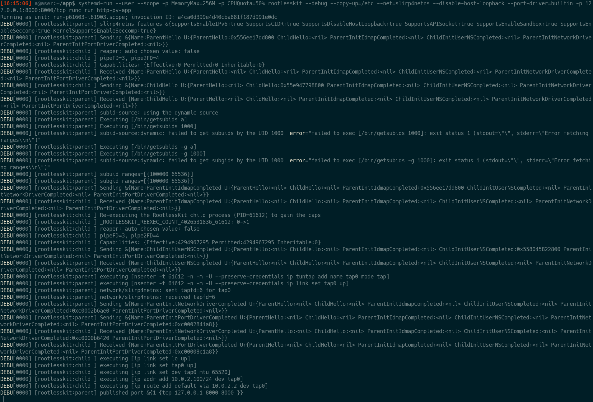

</details>


<details>
<summary>6. Оркестрация кластером Docker контейнеров на примере Docker Swarm</summary>


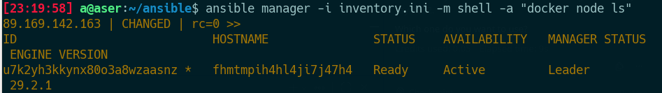


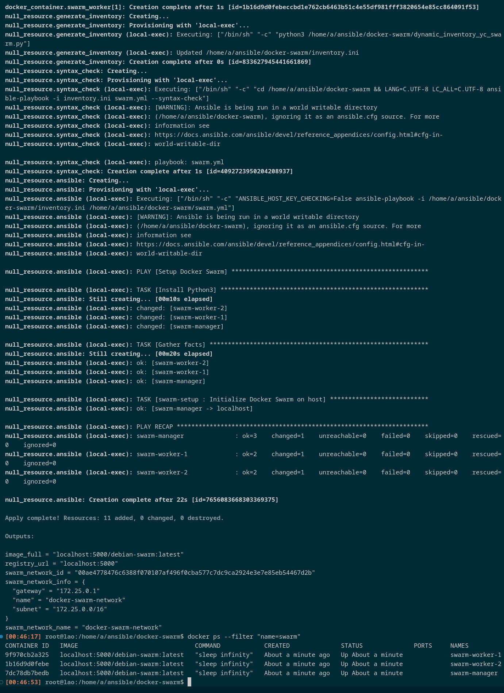


</details>

