# Kubernetes: основы, применение и администрирование

<details>
<summary>1. Kubernetes. Причины появления. Команда kubectl</summary>

# Скриншот дашборда

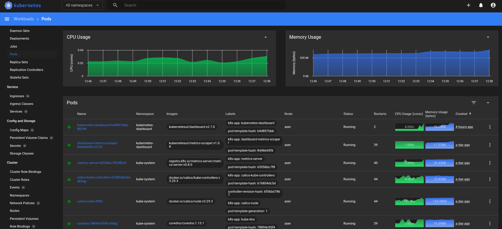

# Вывод комманд `kubectl get nodes`

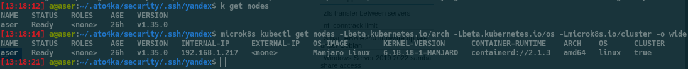


</details>


<details>
<summary>2. Базовые объекты K8S</summary>

# Скриншот `kubectl port-forward service, pod` и  `kubectl get pods`

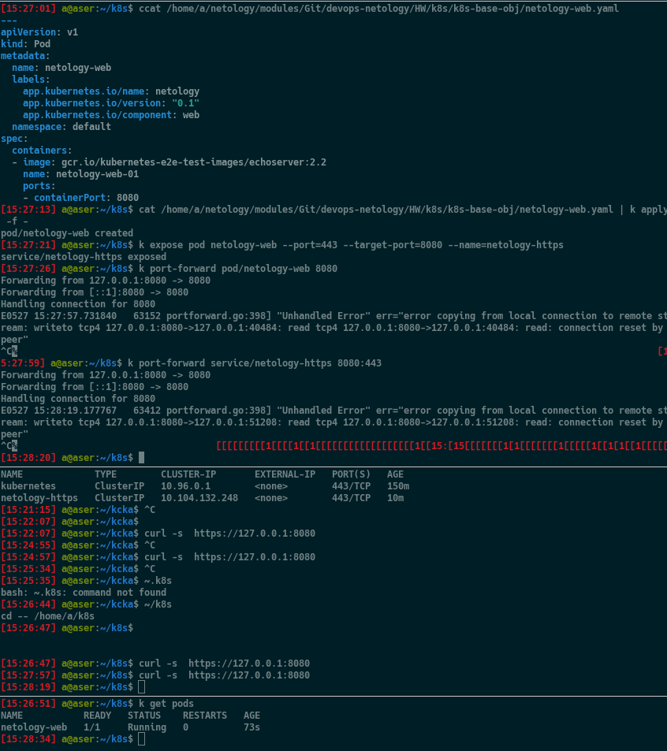


</details>


<details>


<summary>3. Запуск приложений в K8S</summary>

# Задание 1. Создание Deployment и обеспечение доступа к репликам приложения из другого Pod


## Создание Deployment, состоящего из двух контейнеров — nginx и multitool, yaml работающего конфига.  Увеличеник реплик до 2 +  количество подов до и после масштабирования.

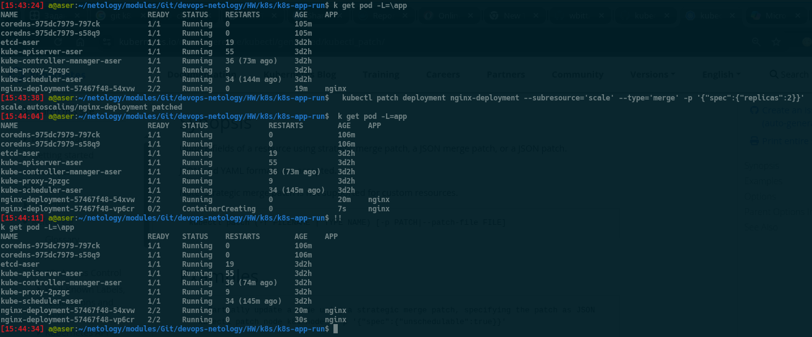

[nginx_multitool.yaml](k8s-app-run/nginx_multitool.yaml)


## Создание Service, который обеспечит доступ до реплик приложений из п.1.


## Создание отдельного Pod с приложением multitool и убедиться с помощью curl, что из пода есть доступ до приложений из п.1.

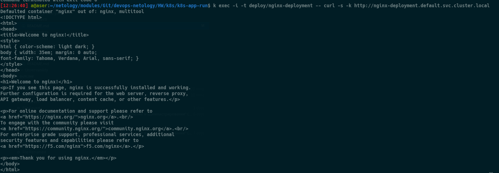

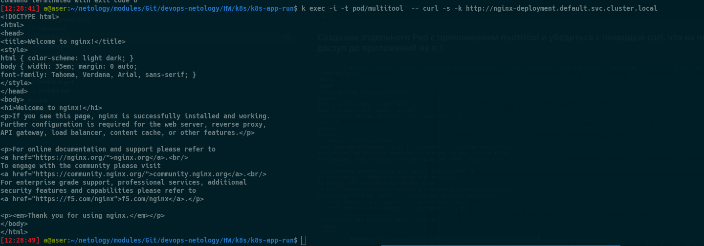


# Задание 2. Создание Deployment и обеспечение  старта основного контейнера при выполнении условий

[nginx-init-container](k8s-app-run/nginx_runs_after_svc.yaml)

## Cостояние пода до запуска сервиса

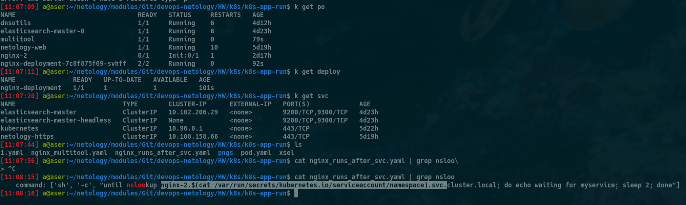

## Состояние пода после запуска сервиса


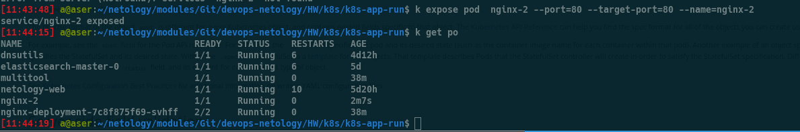


</details>


<details>
<summary>4. Сетевое взаимодействие в Kubernetes</summary>

## Задание 1: Настройка Service (ClusterIP и NodePort)

### Манифесты:
- [deployment-multi-container.yaml](k8s-svc/deployment-multi-container.yaml)
- [service-clusterip.yaml](k8s-svc/service-clusterip.yaml)
- [service-nodeport.yaml](k8s-svc/service-nodeport.yaml)

### Проверка доступности:

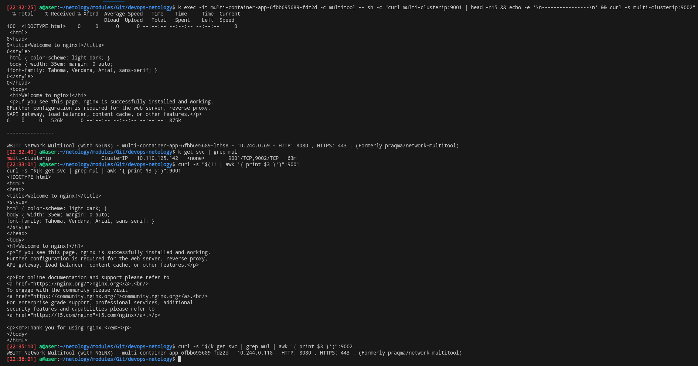

---

## Задание 2: Настройка Ingress

### Манифесты:
- [deployment-frontend.yaml](k8s-svc/deployment-frontend.yaml)
- [deployment-backend.yaml](k8s-svc/deployment-backend.yaml)
- [service-frontend.yaml](k8s-svc/service-frontend.yaml)
- [service-backend.yaml](k8s-svc/service-backend.yaml)
- [ingress.yaml](k8s-svc/ingress.yaml)

### Проверка доступности:

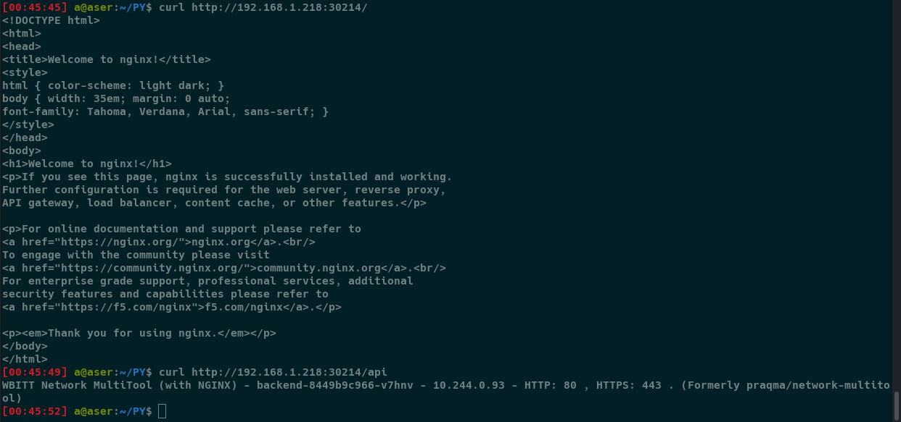

</details>

<details>
<summary>5. Хранение  в K8S</summary>

## Задание 1. Volume: обмен данными между контейнерами в поде

### Манифесты:

- [containers-data-exchange.yaml](k8s-pv/containers-data-exchange.yaml)

### Скриншоты

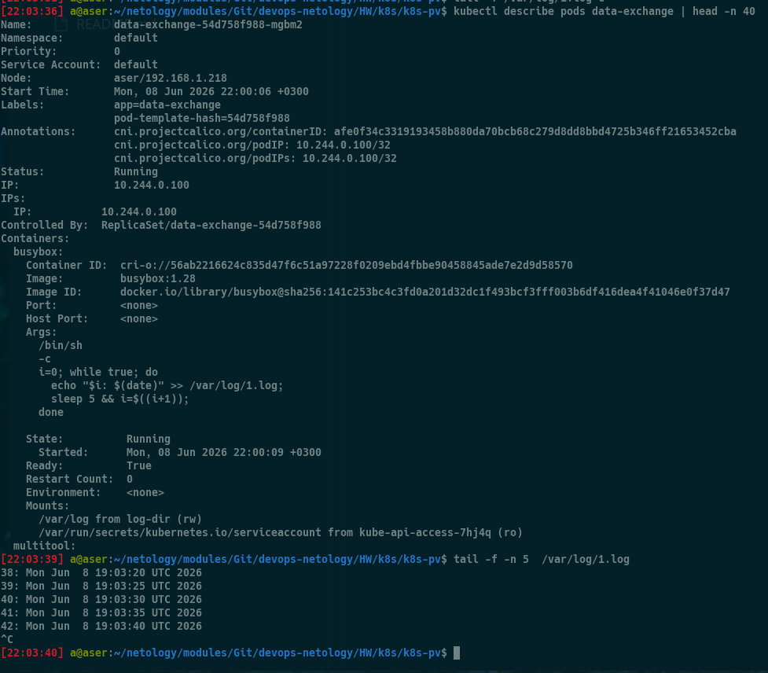


## Задание 2. PV, PVC

### Манифесты:

- [pv-pvc.yaml](k8s-pv/pv-pvc.yaml)

### Скриншоты
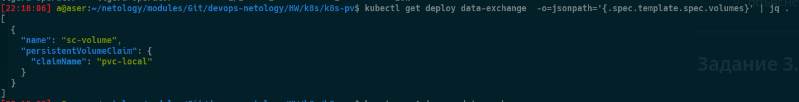
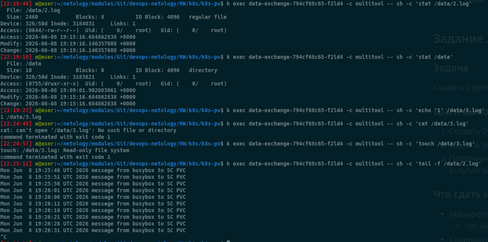
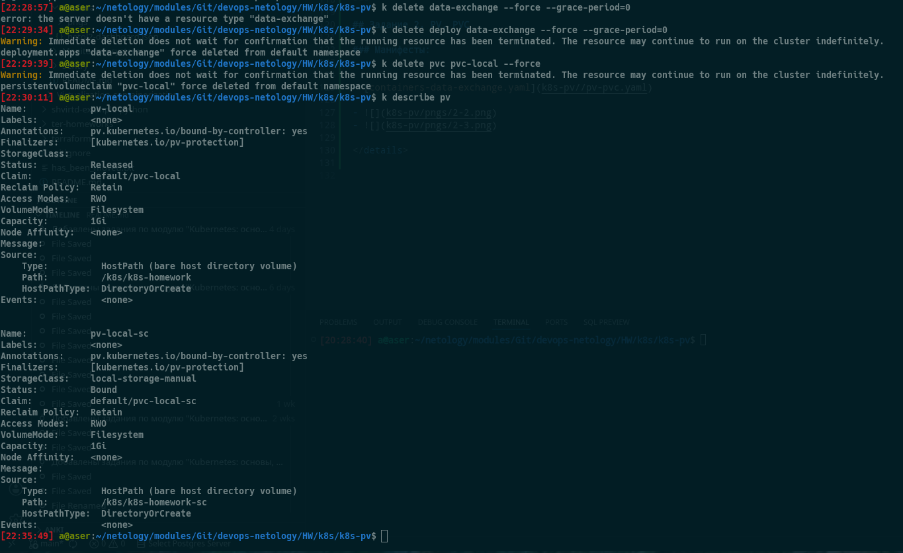

Как следует из описания политики `Retain` PV, её декларирование позволяет вручную высвобождать носители информации. Когда PVC уже удален, PV еще существует со статусом `released`, что видно исходя из представленного скриншота [pv_after_deploy_pvc_deletion](https://kubernetes.io/docs/concepts/storage/persistent-volumes)

## Задание 3. StorageClass

cc

### Скриншоты

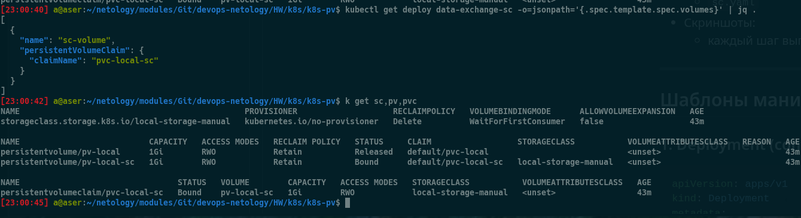

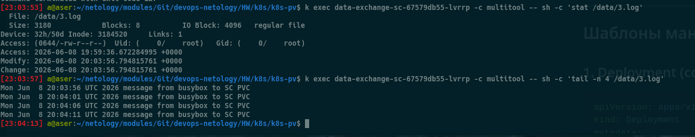

</details>

<details>
<summary>4. Сетевое взаимодействие в Kubernetes</summary>

# Задание 1: Работа с ConfigMaps

### Манифесты:

- [deployment.yaml](k8s-rbac/deployment.yaml)
- [configmap-web.yaml](k8s-rbac/configmap-web.yaml)


### Скриншоты

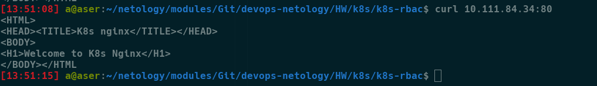

# Задание 2: Настройка HTTPS с Secrets

### Манифесты:

- [secret-tls.yaml](k8s-rbac/secret-tls.yaml)
- [ingress-tls.yaml](k8s-rbac/ingress-tls.yaml)

### Скриншоты

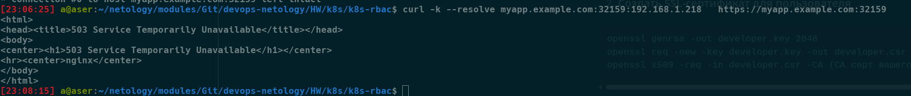


# Задание 3: Настройка RBAC


###  Манифесты:
- [role-pod-reader.yaml](k8s-rbac/role-pod-reader.yaml)
- [rolebinding-developer.yaml](k8s-rbac/rolebinding-developer.yaml)


### Скриншоты

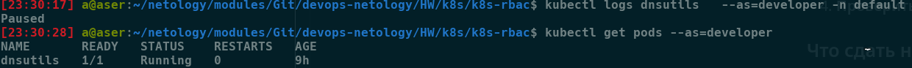

</details>

<details>
<summary>5. Helm</summary>

# Задание 1. Подготовить Helm-чарт для приложения


###  Манифесты:

[values-app1.yaml](k8s-helm/app-template/values-app1.yaml) 

[values-app2.yaml](k8s-helm/app-template/values-app2.yaml)

# Задание 2. Запустить две версии в разных неймспейсах


###  Скриншоты:

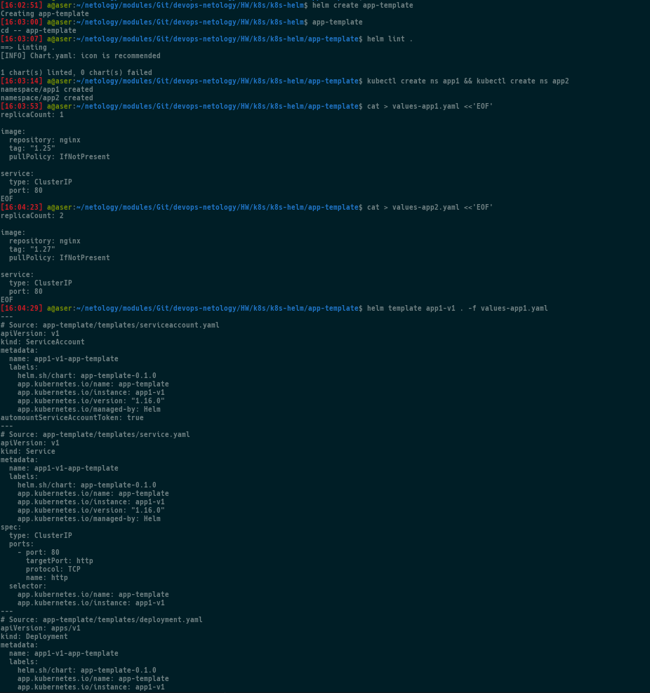

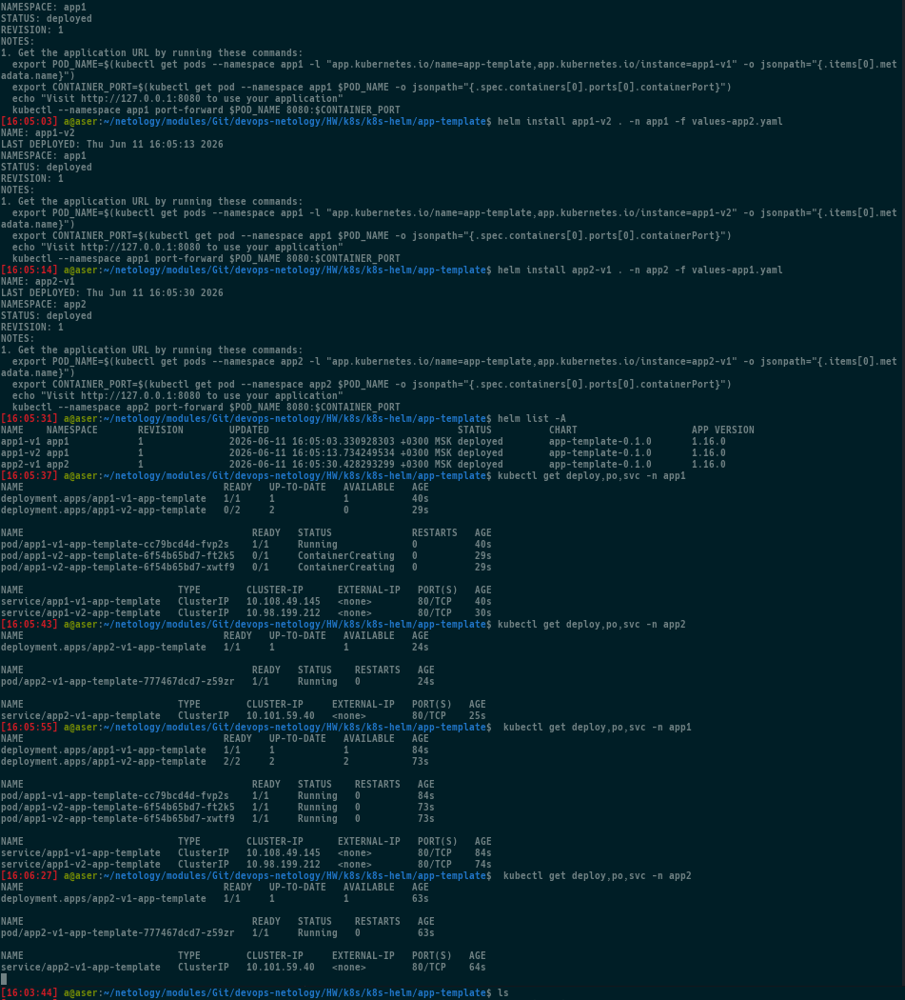

</details>

<details>
<summary>6. Установка Kubernetes с помощью kubeadm, kubespray</summary>

# Домашнее задание к занятию «Установка Kubernetes»

## Задание 1. Установка кластера Kubernetes

Скриншоты проверки  кластера:

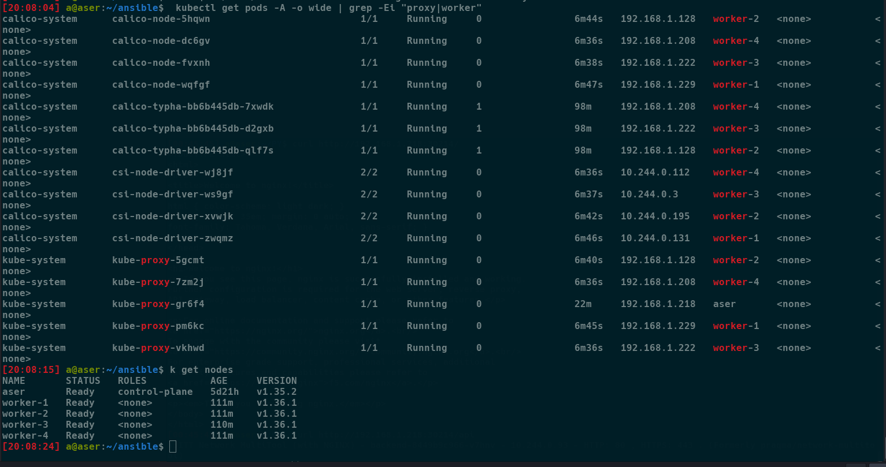


## Задание 2*. Установка HA-кластера

Приведена конфигурация кластера с нечётным количеством нод — 3:

```text
aser
master-2
master-3
```

# Манифесты + Конфигурации 

Для доступа к Kubernetes API используется связка `keepalived + HAProxy`.

## HAProxy

Конфигурация HAProxy:

```text
global
  log stdout local0

defaults
  mode tcp
  timeout connect 5s
  timeout client 50s
  timeout server 50s

listen kubernetes-apiserver
  bind *:16443
  balance roundrobin
  server master1 192.168.1.218:6443 check
  server master2 192.168.1.229:6443 check
  server master3 192.168.1.128:6443 check
```

Манифест мастера

[kubeadm-config](k8s-nodes/manifests/kubeadm-config.yaml)

Конфигурация keepalived master-3

[keepalived-master conf](k8s-nodes/manifests/keepalived-master-3.conf)

Конфигурация keepalived хоста

[keepalived-host](k8s-nodes/manifests/keepalived-host.conf)

# Скриншоты 

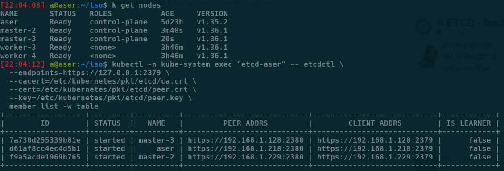

</details>
