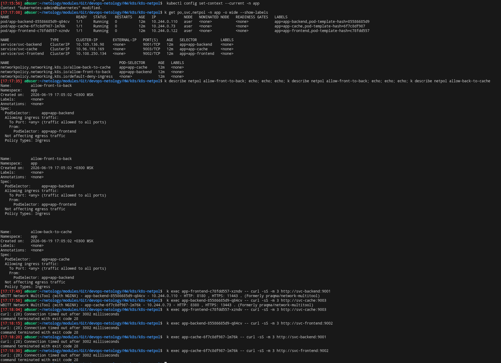

# Kubernetes: основы, применение и администрирование

<details>
<summary>1. Kubernetes. Причины появления. Команда kubectl</summary>

# Скриншот дашборда


# Вывод комманд `kubectl get nodes`


</details>


<details>
<summary>2. Базовые объекты K8S</summary>

# Скриншот `kubectl port-forward service, pod` и  `kubectl get pods`


</details>


<details>


<summary>3. Запуск приложений в K8S</summary>

# Задание 1. Создание Deployment и обеспечение доступа к репликам приложения из другого Pod


## Создание Deployment, состоящего из двух контейнеров — nginx и multitool, yaml работающего конфига.  Увеличеник реплик до 2 +  количество подов до и после масштабирования.


[nginx_multitool.yaml](k8s-app-run/nginx_multitool.yaml)


## Создание Service, который обеспечит доступ до реплик приложений из п.1.


## Создание отдельного Pod с приложением multitool и убедиться с помощью curl, что из пода есть доступ до приложений из п.1.


# Задание 2. Создание Deployment и обеспечение  старта основного контейнера при выполнении условий

[nginx-init-container](k8s-app-run/nginx_runs_after_svc.yaml)

## Cостояние пода до запуска сервиса


## Состояние пода после запуска сервиса


</details>


<details>
<summary>4. Сетевое взаимодействие в Kubernetes</summary>

## Задание 1: Настройка Service (ClusterIP и NodePort)

### Манифесты:
- [deployment-multi-container.yaml](k8s-svc/deployment-multi-container.yaml)
- [service-clusterip.yaml](k8s-svc/service-clusterip.yaml)
- [service-nodeport.yaml](k8s-svc/service-nodeport.yaml)

### Проверка доступности:


---

## Задание 2: Настройка Ingress

### Манифесты:
- [deployment-frontend.yaml](k8s-svc/deployment-frontend.yaml)
- [deployment-backend.yaml](k8s-svc/deployment-backend.yaml)
- [service-frontend.yaml](k8s-svc/service-frontend.yaml)
- [service-backend.yaml](k8s-svc/service-backend.yaml)
- [ingress.yaml](k8s-svc/ingress.yaml)

### Проверка доступности:


</details>

<details>
<summary>5. Хранение  в K8S</summary>

## Задание 1. Volume: обмен данными между контейнерами в поде

### Манифесты:

- [containers-data-exchange.yaml](k8s-pv/containers-data-exchange.yaml)

### Скриншоты


## Задание 2. PV, PVC

### Манифесты:

- [pv-pvc.yaml](k8s-pv/pv-pvc.yaml)

### Скриншоты


Как следует из описания политики `Retain` PV, её декларирование позволяет вручную высвобождать носители информации. Когда PVC уже удален, PV еще существует со статусом `released`, что видно исходя из представленного скриншота [pv_after_deploy_pvc_deletion](https://kubernetes.io/docs/concepts/storage/persistent-volumes)

## Задание 3. StorageClass

cc

### Скриншоты


</details>

<details>
<summary>4. Сетевое взаимодействие в Kubernetes</summary>

# Задание 1: Работа с ConfigMaps

### Манифесты:

- [deployment.yaml](k8s-rbac/deployment.yaml)
- [configmap-web.yaml](k8s-rbac/configmap-web.yaml)


### Скриншоты


# Задание 2: Настройка HTTPS с Secrets

### Манифесты:

- [secret-tls.yaml](k8s-rbac/secret-tls.yaml)
- [ingress-tls.yaml](k8s-rbac/ingress-tls.yaml)

### Скриншоты


# Задание 3: Настройка RBAC


###  Манифесты:
- [role-pod-reader.yaml](k8s-rbac/role-pod-reader.yaml)
- [rolebinding-developer.yaml](k8s-rbac/rolebinding-developer.yaml)


### Скриншоты


</details>

<details>
<summary>5. Helm</summary>

# Задание 1. Подготовить Helm-чарт для приложения


###  Манифесты:

[values-app1.yaml](k8s-helm/app-template/values-app1.yaml) 

[values-app2.yaml](k8s-helm/app-template/values-app2.yaml)

# Задание 2. Запустить две версии в разных неймспейсах


###  Скриншоты:


</details>

<details>
<summary>6. Установка Kubernetes с помощью kubeadm, kubespray</summary>

# Домашнее задание к занятию «Установка Kubernetes»

## Задание 1. Установка кластера Kubernetes

Скриншоты проверки  кластера:


## Задание 2*. Установка HA-кластера

Приведена конфигурация кластера с нечётным количеством нод — 3:

```text
aser
master-2
master-3
```

# Манифесты + Конфигурации 

Для доступа к Kubernetes API используется связка `keepalived + HAProxy`.

## HAProxy

Конфигурация HAProxy:

```text
global
  log stdout local0

defaults
  mode tcp
  timeout connect 5s
  timeout client 50s
  timeout server 50s

listen kubernetes-apiserver
  bind *:16443
  balance roundrobin
  server master1 192.168.1.218:6443 check
  server master2 192.168.1.229:6443 check
  server master3 192.168.1.128:6443 check
```

Манифест мастера

[kubeadm-config](k8s-nodes/manifests/kubeadm-config.yaml)

Конфигурация keepalived master-3

[keepalived-master conf](k8s-nodes/manifests/keepalived-master-3.conf)

Конфигурация keepalived хоста

[keepalived-host](k8s-nodes/manifests/keepalived-host.conf)

# Скриншоты 


</details>


<details>
<summary>7. Компоненты Kubernetes</summary>

# Расчёт ресурсов Kubernetes-кластера

## Минимальная конфигурация

| Тип ноды | Количество | Количество ядер ЦПУ / ОЗУ |
| -------- | ---------: | ------------------------- |
| Worker   |          5 | 8 vCPU / 16 GB RAM        |

Если кластер self-managed, дополнительно нужны control-plane ноды:

| Тип ноды      | Количество | Количество ядер ЦПУ / ОЗУ |
| ------------- | ---------: | ------------------------- |
| Control-plane |          3 | 2 vCPU / 4 GB RAM         |

Минимальный вариант для managed Kubernetes: **5 worker-нод по 8 vCPU / 16 GB RAM**.

После отказа одной worker-ноды остаётся **21.6 CPU** и **50.4 GB RAM** доступных ресурсов. Приложению требуется **17 CPU** и **30.25 GB RAM**.

## Размещение workload

| Компонент | Kubernetes object | Реплик | Размещение                                                    |
| --------- | ----------------- | -----: | ------------------------------------------------------------- |
| Database  | StatefulSet       |      3 | по worker-нодам с podAntiAffinity + topologySpreadConstraints |
| Cache     | StatefulSet       |      3 | по worker-нодам с podAntiAffinity + topologySpreadConstraints |
| Backend   | Deployment        |     10 | worker-ноды                                                   |
| Frontend  | Deployment        |      5 | worker-ноды                                                   |

Для Database и Cache предполагается использование PVC.

## Helm chart

Приложение упаковывается в Helm chart со следующими основными манифестами:

Deployment, StatefulSet, Service, Ingress, PVC.

Для минимального набора окружений используются отдельные values-файлы:

| Файл              | Назначение       |
| ----------------- | ---------------- |
| values.yaml       | базовые значения |
| values-dev.yaml   | dev              |
| values-stage.yaml | stage            |
| values-prod.yaml  | prod             |

В `values` выносятся:

| Блок       | Параметры                                            |
| ---------- | ---------------------------------------------------- |
| frontend   | replicas, image, resources, service, ingress         |
| backend    | replicas, image, resources, service                  |
| database   | replicas, resources, storageClass, pvcSize           |
| cache      | replicas, resources, storageClass, pvcSize           |
| scheduling | nodeSelector, tolerations, topologySpreadConstraints |

## Расчёт ресурсов приложения

| Компонент |     Реплик | RAM на 1 pod | CPU на 1 pod |    Всего RAM |  Всего CPU |
| --------- | ---------: | -----------: | -----------: | -----------: | ---------: |
| Database  |          3 |         4 GB |        1 CPU |        12 GB |      3 CPU |
| Cache     |          3 |         4 GB |        1 CPU |        12 GB |      3 CPU |
| Frontend  |          5 |        50 MB |      0.2 CPU |       250 MB |      1 CPU |
| Backend   |         10 |       600 MB |        1 CPU |         6 GB |     10 CPU |
| **Итого** | **21 pod** |              |              | **30.25 GB** | **17 CPU** |

## Расчёт одной worker-ноды

Берётся worker-нода: **8 vCPU / 16 GB RAM**.

В расчёт системного резерва включается Calico Open Source. Для single-node Calico минимальные требования к host:

| Ресурс | Minimum |
| ------ | ------: |
| CPU    | 2 cores |
| RAM    |    2 GB |
| Disk   |   10 GB |

Расчёт остатка ресурсов за вычетом ОС, kubelet, DaemonSet и Calico:

| Ресурс |   Raw | System reserve с учётом Calico | Остаток |
| ------ | ----: | -----------------------------: | ------: |
| CPU    | 8 CPU |                          2 CPU |   6 CPU |
| RAM    | 16 GB |                           2 GB |   14 GB |

Расчёт 10% safety overhead:

| Ресурс | Остаток | 10% overhead | Доступно для pod'ов |
| ------ | ------: | -----------: | ------------------: |
| CPU    |   6 CPU |      0.6 CPU |         **5.4 CPU** |
| RAM    |   14 GB |       1.4 GB |         **12.6 GB** |

## Проверка 4 worker-нод

| Показатель                          |            CPU |      RAM |
| ----------------------------------- | -------------: | -------: |
| Доступно на 4 worker-нодах          |       21.6 CPU |  50.4 GB |
| Доступно после отказа 1 worker-ноды |       16.2 CPU |  37.8 GB |
| Требуется приложению                |         17 CPU | 30.25 GB |
| Остаток после отказа 1 worker-ноды  |       -0.8 CPU |  7.55 GB |
| Результат                           | Не хватает CPU |       OK |

Вывод: **4 worker-ноды недостаточно**, так как после отказа одной ноды остаётся только **16.2 CPU**, а приложению требуется **17 CPU**.

## Расчёт worker-пула

Принимается **5 worker-нод**.

| Показатель                          |      CPU |      RAM |
| ----------------------------------- | -------: | -------: |
| Доступно на 5 worker-нодах          |   27 CPU |    63 GB |
| Доступно после отказа 1 worker-ноды | 21.6 CPU |  50.4 GB |
| Требуется приложению                |   17 CPU | 30.25 GB |
| Остаток после отказа 1 worker-ноды  |  4.6 CPU | 20.15 GB |

## Распределение ресурсов

| Ресурс | Требуется | Доступно после отказа 1 ноды |    Запас |
| ------ | --------: | ---------------------------: | -------: |
| CPU    |    17 CPU |                     21.6 CPU |  4.6 CPU |
| RAM    |  30.25 GB |                      50.4 GB | 20.15 GB |
| Pods   |    21 pod |   4 worker-ноды после отказа |       OK |

## Вывод

Минимально достаточно **5 worker-нод по 8 vCPU / 16 GB RAM**.

Расчёт учитывает:

* ресурсы приложения;
* системный резерв на ОС, kubelet, DaemonSet и Calico;
* минимальные требования Calico Open Source: 2 CPU, 2 GB RAM, 10 GB disk;
* 10% safety overhead;
* отказ 1 worker-ноды;
* StatefulSet на PVC;
* Helm chart.

## Ограничения расчёта для использования на практике

Расчёт определяет минимальные compute-ресурсы кластера: **CPU, RAM и количество worker-нод**.

В расчёт `не включены`:

| Ресурс / услуга           | Причина                                                  |
| ------------------------- | -------------------------------------------------------- |
| IOPS дисков               | зависит от типа StorageClass и тарифа провайдера по IOPS |
| throughput дисков         | зависит от типа persistent storage                       |
| объём PVC                 | зависит от тарифа провайдера                             |
| snapshots / backups       | оплачиваются отдельно в managed Kubernetes               |
| load balancer             | зависит от cloud-провайдера                              |
| public IP                 | может тарифицироваться отдельно                          |
| network traffic           | зависит от входящего/исходящего трафика                  |
| managed control-plane fee | зависит от провайдера                                    |
| monitoring / logging      | может потреблять ресурсы и оплачиваться отдельно         |

Итоговая стоимость managed Kubernetes может отличаться от расчёта, так как у провайдера могут отдельно оплачиваться storage, IOPS, traffic, load balancer, snapshots, logging, monitoring и обслуживание control-plane.


</details>

<details>
<summary>8. Как работает сеть в K8S</summary>
 

## Манифесты 

* [`app-frontend.yaml`](k8s-netpol/app-frontend.yaml) — Deployment для pod `frontend`.
* [`app-backend.yaml`](k8s-netpol/app-backend.yaml) — Deployment для pod `backend`.
* [`app-cache.yaml`](k8s-netpol/app-cache.yaml) — Deployment для pod `cache`.
* [`svc-frontend.yaml`](k8s-netpol/svc-frontend.yaml) — Service для доступа к `frontend`.
* [`svc-backend.yaml`](k8s-netpol/svc-backend.yaml) — Service для доступа к `backend`.
* [`svc-cache.yaml`](k8s-netpol/svc-cache.yaml) — Service для доступа к `cache`.
* [`np.yaml`](k8s-netpol/np.yaml) — NetworkPolicy: общий запрет входящего трафика. Политики работают по принципу `default deny` с учетом следующего: разрешены направления `frontend -> backend`, `backend -> cache`; остальные - заблокированы.

## Скриншоты



</details>
